# EcoSphere — Architecture Document

> **Audience:** AI agents and human developers building EcoSphere.
> **Source of truth for:** system design, data flow, component boundaries, and implementation logic.
> **Companion docs:** `rules.md` (business rules), `gamification.md` (game mechanics), `brand.md` (visual identity), `techstack.md` (exact libraries/versions).

---

## Table of Contents

1. [System Overview](#1-system-overview)
2. [High-Level Design (HLD)](#2-high-level-design-hld)
3. [Module Decomposition](#3-module-decomposition)
4. [Low-Level Design (LLD)](#4-low-level-design-lld)
5. [Data Model (Detailed)](#5-data-model-detailed)
6. [System Flows](#6-system-flows)
7. [API Design](#7-api-design)
8. [Authentication & Authorization (RBAC)](#8-authentication--authorization-rbac)
9. [Event-Driven Architecture](#9-event-driven-architecture)
10. [Scoring Engine](#10-scoring-engine)
11. [Notification Pipeline](#11-notification-pipeline)
12. [Report Generation Pipeline](#12-report-generation-pipeline)
13. [File Upload & Evidence System](#13-file-upload--evidence-system)
14. [Deployment Architecture](#14-deployment-architecture)
15. [Error Handling & Resilience](#15-error-handling--resilience)
16. [Security Architecture](#16-security-architecture)

---

## 1. System Overview

EcoSphere is an ESG (Environmental, Social, Governance) Management Platform that integrates sustainability tracking, employee engagement, compliance management, and gamification into a single system.

### 1.1 Architecture Style

**Modular Monolith** — a single Django application with clearly separated internal modules (Django apps), communicating through well-defined service interfaces and Django signals. Not microservices (unnecessary complexity at this scale), not a tangled monolith (modules have explicit boundaries).

### 1.2 System Context

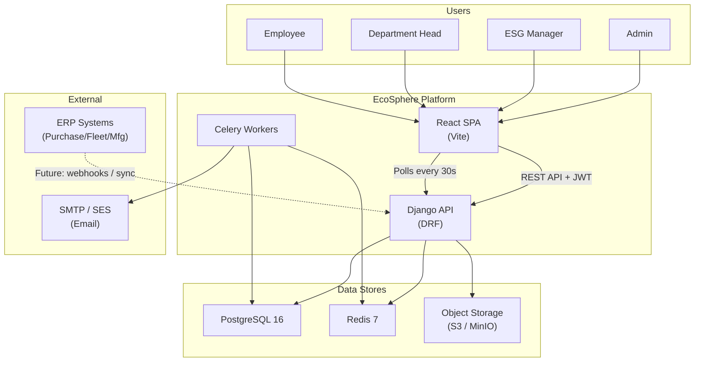

---

## 2. High-Level Design (HLD)

### 2.1 Layered Architecture

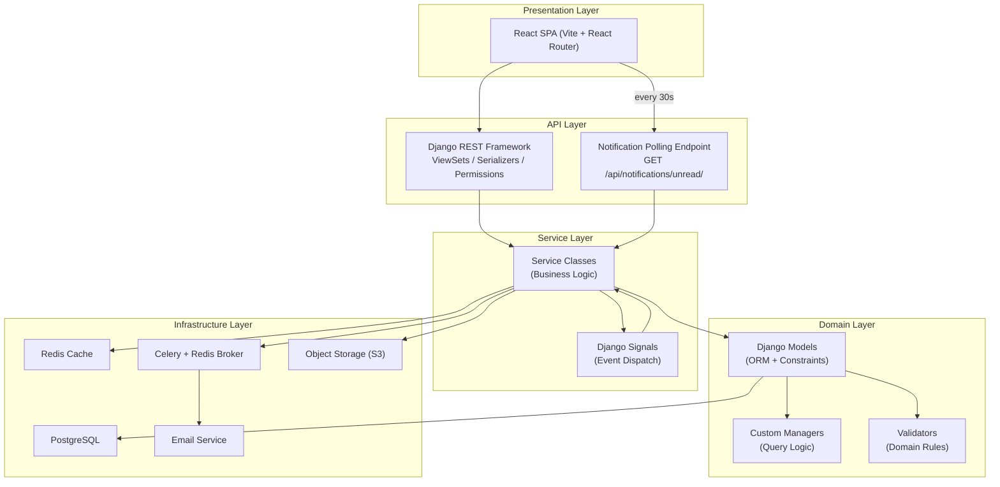

### 2.2 Key Design Principles

| Principle | How it's applied |
|---|---|
| **Separation of concerns** | Views handle HTTP, Services handle business logic, Models handle data integrity |
| **Server-side truth** | Scores, XP, badge unlocks are computed server-side only — never trust client-submitted values |
| **Append-only audit data** | Department Scores, Badge Awards, Reward Redemptions are immutable historical records |
| **Event-driven side effects** | Badge unlock, notification dispatch, leaderboard update happen via signals — not inline in views |
| **Fail-safe constraints** | Negative balances / stock prevented at DB level (`CHECK` constraints) + application level |
| **Configuration over code** | ESG weights, toggles (evidence, auto-emission, badge auto-award) read from DB settings at runtime |

---

## 3. Module Decomposition

### 3.1 Django Apps

```mermaid
graph LR
    subgraph Core["core"]
        D["Department"]
        E["Employee"]
        CAT["Category"]
        SET["SiteSettings"]
    end

    subgraph Environmental["environmental"]
        EF["EmissionFactor"]
        CT["CarbonTransaction"]
        EG["EnvironmentalGoal"]
        PP["ProductESGProfile"]
    end

    subgraph Social["social"]
        CSR["CSRActivity"]
        EP["EmployeeParticipation"]
    end

    subgraph Governance["governance"]
        POL["ESGPolicy"]
        PA["PolicyAcknowledgement"]
        AUD["Audit"]
        CI["ComplianceIssue"]
    end

    subgraph Gamification["gamification"]
        GD["GoalDefinition"]
        GL["Goal"]
        CH["Challenge"]
        CP["ChallengeParticipation"]
        BA["Badge"]
        EB["EmployeeBadge"]
        RW["Reward"]
        RR["RewardRedemption"]
    end

    subgraph Scoring["scoring"]
        DS["DepartmentScore"]
        SE["ScoringEngine"]
    end

    subgraph Notifications["notifications"]
        NE["NotificationEvent"]
        NP["NotificationPreference"]
        NS["NotificationSender"]
    end

    subgraph Reports["reports"]
        RB["ReportBuilder"]
        EX["Exporters (PDF/Excel/CSV)"]
    end

    Core --> Environmental
    Core --> Social
    Core --> Governance
    Core --> Gamification
    Social --> Gamification
    Environmental --> Scoring
    Social --> Scoring
    Governance --> Scoring
    Gamification --> Scoring
    Core --> Notifications
    Scoring --> Notifications
    Gamification --> Notifications
    Governance --> Notifications
```

### 3.2 Module Responsibilities

| App | Owns | Does NOT own |
|---|---|---|
| `core` | Department hierarchy, Employee profiles, Categories, Site Settings | Business logic for any ESG pillar |
| `environmental` | Emission Factors, Carbon Transactions, Environmental Goals, Product ESG Profiles | Score calculation (→ `scoring`) |
| `social` | CSR Activities, Employee Participation (in CSR), Diversity metrics | Challenge Participation (→ `gamification`) |
| `governance` | ESG Policies, Policy Acknowledgements, Audits, Compliance Issues | Score aggregation (→ `scoring`) |
| `gamification` | Goal Definitions, Goals, Challenges, Challenge Participation, Badges, Rewards, Leaderboards | CSR Activity management (→ `social`) |
| `scoring` | Department Score records, score calculation engine, ESG weight configuration | Raw data collection (→ pillar apps) |
| `notifications` | Notification dispatch, preferences, templates, polling endpoint | Business event detection (→ signals in source apps) |
| `reports` | Report builder, filter logic, PDF/Excel/CSV export | Data queries (uses ORM from pillar apps) |

---

## 4. Low-Level Design (LLD)

### 4.1 Service Layer Pattern

Every Django app follows this internal structure:

```
apps/gamification/
├── __init__.py
├── models.py          # Django models (data layer)
├── managers.py        # Custom QuerySet managers
├── serializers.py     # DRF serializers (API I/O)
├── views.py           # DRF ViewSets (HTTP handling)
├── services.py        # Business logic (the brain)
├── signals.py         # Signal handlers (side effects)
├── permissions.py     # Custom DRF permissions
├── validators.py      # Domain validation rules
├── filters.py         # django-filter FilterSets
├── urls.py            # URL routing
├── admin.py           # Django Admin configuration
├── tasks.py           # Celery async tasks
├── tests/
│   ├── test_models.py
│   ├── test_services.py
│   ├── test_views.py
│   └── test_signals.py
└── migrations/
```

**Rule: Views call Services. Services call Models. Signals call Services. Never skip layers.**

```python
# CORRECT — View → Service → Model
class ChallengeParticipationViewSet(ModelViewSet):
    def perform_update(self, serializer):
        instance = serializer.save()
        if instance.status == 'approved':
            gamification_service.approve_participation(instance)

# WRONG — Business logic in the view
class ChallengeParticipationViewSet(ModelViewSet):
    def perform_update(self, serializer):
        instance = serializer.save()
        if instance.status == 'approved':
            instance.employee.xp_total += instance.challenge.xp  # NO
            instance.employee.save()                               # NO
```

### 4.2 Service Interface Examples

```python
# apps/gamification/services.py

class GamificationService:
    """All gamification business logic lives here."""

    @transaction.atomic
    def approve_participation(self, participation: ChallengeParticipation) -> None:
        """Approve a challenge participation — triggers XP, badge, notification chain."""
        self._validate_approver_is_not_participant(participation)
        self._validate_evidence_if_required(participation)
        participation.status = 'approved'
        participation.xp_awarded = participation.challenge.xp
        participation.save()
        self._award_xp(participation.employee, participation.xp_awarded)
        # Signal fires here → badge check + notification happen as side effects

    @transaction.atomic
    def redeem_reward(self, employee: Employee, reward: Reward) -> RewardRedemption:
        """Redeem a reward — checks balance + stock atomically."""
        reward = Reward.objects.select_for_update().get(pk=reward.pk)
        if employee.points_balance < reward.points_required:
            raise InsufficientPointsError()
        if reward.stock <= 0:
            raise OutOfStockError()
        employee.points_balance -= reward.points_required
        employee.save()
        reward.stock -= 1
        reward.save()
        return RewardRedemption.objects.create(
            employee=employee, reward=reward,
            points_spent=reward.points_required, status='pending_fulfillment'
        )
```

---

## 5. Data Model (Detailed)

### 5.1 Entity Relationship Diagram

```mermaid
erDiagram
    DEPARTMENT ||--o{ EMPLOYEE : employs
    DEPARTMENT ||--o{ CARBON_TRANSACTION : incurs
    DEPARTMENT ||--o{ CSR_ACTIVITY : hosts
    DEPARTMENT ||--o{ AUDIT : is_audited
    DEPARTMENT ||--o{ DEPARTMENT_SCORE : scored_as
    DEPARTMENT ||--o{ CHALLENGE : scoped_to
    DEPARTMENT }o--o| DEPARTMENT : parent_of

    EMPLOYEE ||--o{ EMPLOYEE_PARTICIPATION : logs
    EMPLOYEE ||--o{ CHALLENGE_PARTICIPATION : joins
    EMPLOYEE ||--o{ POLICY_ACKNOWLEDGEMENT : signs
    EMPLOYEE ||--o{ EMPLOYEE_BADGE : earns
    EMPLOYEE ||--o{ REWARD_REDEMPTION : redeems
    EMPLOYEE ||--o{ COMPLIANCE_ISSUE : owns

    CATEGORY ||--o{ CSR_ACTIVITY : classifies
    CATEGORY ||--o{ CHALLENGE : classifies

    EMISSION_FACTOR ||--o{ CARBON_TRANSACTION : rates

    CSR_ACTIVITY ||--o{ EMPLOYEE_PARTICIPATION : tracked_by
    CHALLENGE ||--o{ CHALLENGE_PARTICIPATION : tracked_by
    CHALLENGE ||--o{ GOAL : contains
    GOAL_DEFINITION ||--o{ GOAL : instantiated_as

    AUDIT ||--o{ COMPLIANCE_ISSUE : raises
    ESG_POLICY ||--o{ POLICY_ACKNOWLEDGEMENT : acknowledged_via

    BADGE ||--o{ EMPLOYEE_BADGE : unlocked_as
    REWARD ||--o{ REWARD_REDEMPTION : claimed_as

    DEPARTMENT {
        uuid id PK
        string name
        string code
        uuid head_employee_id FK
        uuid parent_department_id FK
        int employee_count
        string status
    }

    EMPLOYEE {
        uuid id PK
        uuid user_id FK
        uuid department_id FK
        int xp_total
        int points_balance
        string role
    }

    SITE_SETTINGS {
        uuid id PK
        bool auto_emission_calculation_enabled
        bool evidence_requirement_enabled
        bool badge_auto_award_enabled
        decimal environmental_weight
        decimal social_weight
        decimal governance_weight
    }

    EMISSION_FACTOR {
        uuid id PK
        string name
        string source_type
        decimal factor_value
        string unit
        string standard_reference
    }

    CARBON_TRANSACTION {
        uuid id PK
        uuid department_id FK
        uuid emission_factor_id FK
        decimal quantity
        decimal co2e_amount
        string source_record_type
        uuid source_record_id
        bool is_manual_override
        text override_reason
        date transaction_date
        datetime created_at
    }

    ENVIRONMENTAL_GOAL {
        uuid id PK
        string title
        uuid department_id FK
        decimal target_value
        decimal current_value
        string unit
        date start_date
        date end_date
        string status
    }

    CSR_ACTIVITY {
        uuid id PK
        string title
        uuid department_id FK
        uuid category_id FK
        text description
        date activity_date
        string status
        int points_value
    }

    EMPLOYEE_PARTICIPATION {
        uuid id PK
        uuid employee_id FK
        uuid activity_id FK
        string approval_status
        int points_earned
        uuid approved_by_id FK
        datetime approved_at
        string proof_file_path
        date completion_date
    }

    CATEGORY {
        uuid id PK
        string name
        string type
        string status
    }

    GOAL_DEFINITION {
        uuid id PK
        string name
        string source_model
        string source_field
        string computation
        string scope
        string suffix
    }

    GOAL {
        uuid id PK
        uuid goal_definition_id FK
        uuid challenge_id FK
        string condition
        decimal target_value
        decimal current_value
    }

    CHALLENGE {
        uuid id PK
        string title
        uuid category_id FK
        uuid department_id FK
        text description
        int xp
        string difficulty
        string periodicity
        string assignment_rule
        bool evidence_required
        date start_date
        date deadline
        string status
    }

    CHALLENGE_PARTICIPATION {
        uuid id PK
        uuid challenge_id FK
        uuid employee_id FK
        decimal progress
        string proof_file_path
        string approval_status
        uuid approved_by_id FK
        int xp_awarded
        string status
    }

    ESG_POLICY {
        uuid id PK
        string title
        text content
        string version
        date effective_date
        string status
    }

    POLICY_ACKNOWLEDGEMENT {
        uuid id PK
        uuid policy_id FK
        uuid employee_id FK
        datetime acknowledged_at
        string signature
    }

    AUDIT {
        uuid id PK
        uuid department_id FK
        string title
        string audit_type
        date audit_date
        string status
        uuid auditor_id FK
        text findings
    }

    COMPLIANCE_ISSUE {
        uuid id PK
        uuid audit_id FK
        uuid owner_employee_id FK
        string severity
        text description
        date due_date
        string status
        datetime resolved_at
    }

    DEPARTMENT_SCORE {
        uuid id PK
        uuid department_id FK
        decimal environmental_score
        decimal social_score
        decimal governance_score
        decimal total_score
        date period_start
        date period_end
        datetime calculated_at
    }

    BADGE {
        uuid id PK
        string name
        text description
        string unlock_rule_type
        uuid unlock_goal_definition_id FK
        decimal unlock_threshold
        string grant_permission
        int limitation_number
        string icon_path
    }

    EMPLOYEE_BADGE {
        uuid id PK
        uuid employee_id FK
        uuid badge_id FK
        datetime awarded_at
        uuid granted_by_id FK
        string award_type
    }

    REWARD {
        uuid id PK
        string name
        text description
        int points_required
        int stock
        string status
    }

    REWARD_REDEMPTION {
        uuid id PK
        uuid employee_id FK
        uuid reward_id FK
        int points_spent
        string status
        datetime redeemed_at
        datetime fulfilled_at
    }
```

### 5.2 Database Constraints (PostgreSQL Level)

These constraints are enforced at the database level — they cannot be bypassed even by raw SQL or admin scripts:

```sql
-- Employee: no negative XP or Points
ALTER TABLE employee ADD CONSTRAINT chk_xp_non_negative CHECK (xp_total >= 0);
ALTER TABLE employee ADD CONSTRAINT chk_points_non_negative CHECK (points_balance >= 0);

-- Reward: no negative stock
ALTER TABLE reward ADD CONSTRAINT chk_stock_non_negative CHECK (stock >= 0);

-- Compliance Issue: Owner and Due Date are mandatory
ALTER TABLE compliance_issue ADD CONSTRAINT chk_owner_required CHECK (owner_employee_id IS NOT NULL);
ALTER TABLE compliance_issue ADD CONSTRAINT chk_due_date_required CHECK (due_date IS NOT NULL);

-- Department Score: scores are 0-100 range
ALTER TABLE department_score ADD CONSTRAINT chk_env_score_range CHECK (environmental_score BETWEEN 0 AND 100);
ALTER TABLE department_score ADD CONSTRAINT chk_soc_score_range CHECK (social_score BETWEEN 0 AND 100);
ALTER TABLE department_score ADD CONSTRAINT chk_gov_score_range CHECK (governance_score BETWEEN 0 AND 100);

-- ESG weights must sum to 1.0
ALTER TABLE site_settings ADD CONSTRAINT chk_weights_sum
    CHECK (environmental_weight + social_weight + governance_weight = 1.0);
```

### 5.3 Indexing Strategy

```sql
-- High-frequency query patterns that need indexes
CREATE INDEX idx_carbon_tx_dept_date ON carbon_transaction (department_id, transaction_date);
CREATE INDEX idx_participation_employee ON employee_participation (employee_id, approval_status);
CREATE INDEX idx_challenge_status ON challenge (status, deadline);
CREATE INDEX idx_compliance_due ON compliance_issue (due_date, status);
CREATE INDEX idx_dept_score_period ON department_score (department_id, period_start, period_end);
CREATE INDEX idx_employee_badge ON employee_badge (employee_id, badge_id);
CREATE INDEX idx_challenge_part_employee ON challenge_participation (employee_id, status);
```

---

## 6. System Flows

### 6.1 CSR Participation → Approval → Points Award

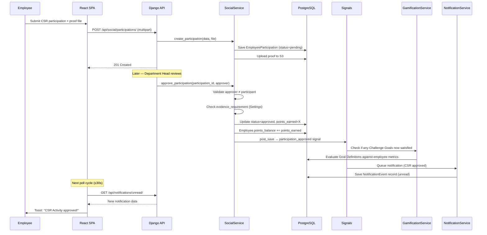

### 6.2 Challenge Lifecycle

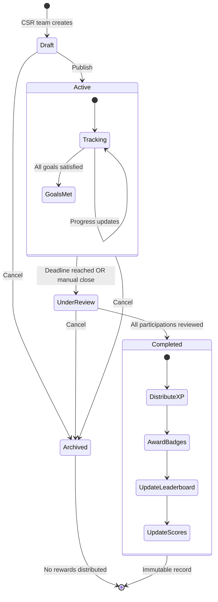

### 6.3 Badge Auto-Award Event Chain

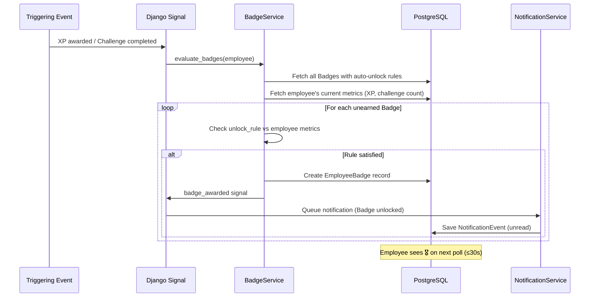

### 6.4 Reward Redemption (Atomic)

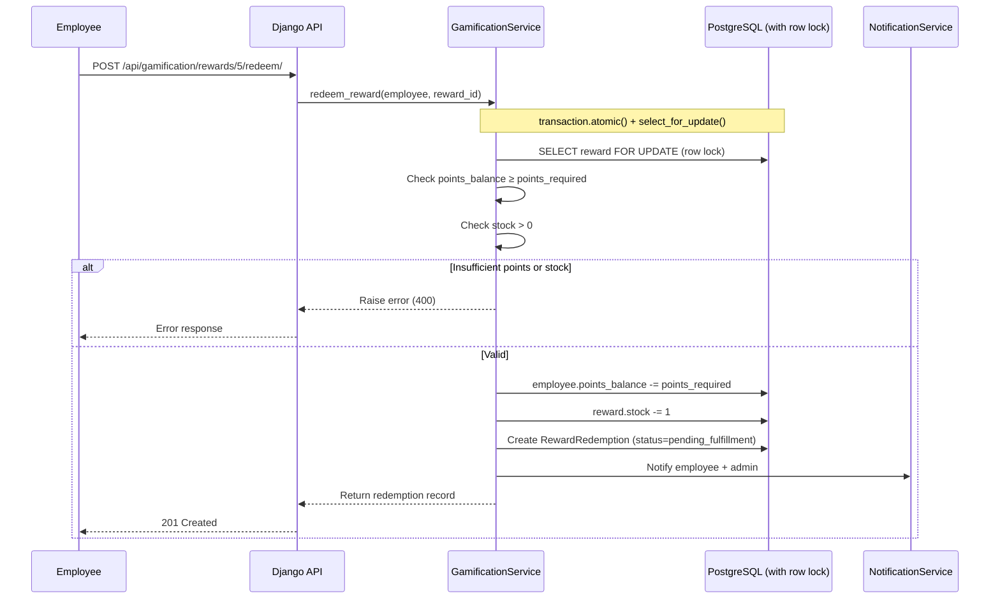

### 6.5 Carbon Auto-Calculation Flow

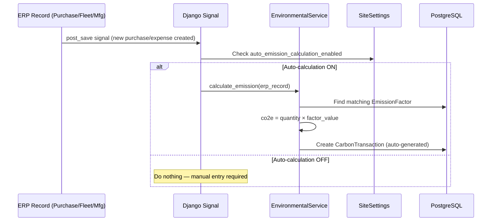

### 6.6 Score Calculation Pipeline

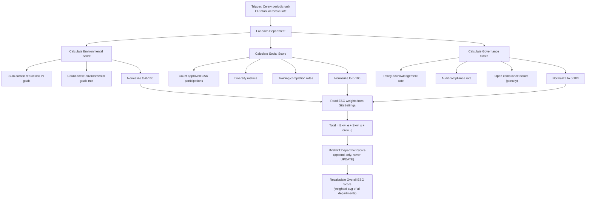

### 6.7 Compliance Issue Escalation

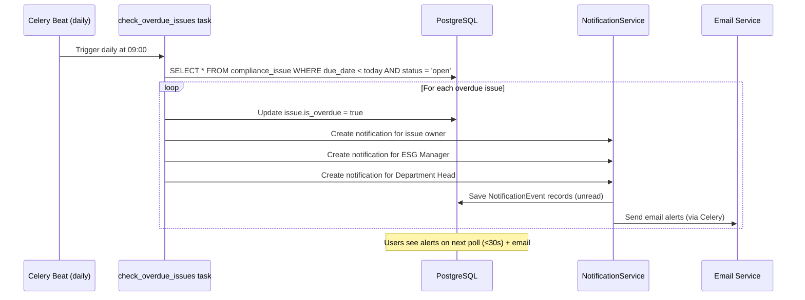

---

## 7. API Design

### 7.1 URL Structure

All API endpoints follow REST conventions with resource-based, plural noun URLs:

```
/api/v1/
├── auth/
│   ├── login/                    POST
│   ├── logout/                   POST
│   ├── refresh/                  POST
│   └── me/                       GET, PATCH
│
├── core/
│   ├── departments/              GET, POST
│   ├── departments/{id}/         GET, PUT, PATCH, DELETE
│   ├── departments/{id}/employees/   GET
│   ├── employees/                GET, POST
│   ├── employees/{id}/           GET, PUT, PATCH
│   ├── categories/               GET, POST
│   ├── categories/{id}/          GET, PUT, PATCH, DELETE
│   └── settings/                 GET, PUT (admin only)
│
├── environmental/
│   ├── emission-factors/         GET, POST
│   ├── emission-factors/{id}/    GET, PUT, PATCH, DELETE
│   ├── carbon-transactions/      GET, POST
│   ├── carbon-transactions/{id}/ GET, PUT, PATCH
│   ├── goals/                    GET, POST
│   └── goals/{id}/               GET, PUT, PATCH
│
├── social/
│   ├── csr-activities/           GET, POST
│   ├── csr-activities/{id}/      GET, PUT, PATCH
│   ├── participations/           GET, POST
│   ├── participations/{id}/      GET, PATCH
│   ├── participations/{id}/approve/   POST
│   ├── participations/{id}/reject/    POST
│   └── participations/{id}/evidence/  POST (file upload)
│
├── governance/
│   ├── policies/                 GET, POST
│   ├── policies/{id}/            GET, PUT, PATCH
│   ├── acknowledgements/         GET, POST
│   ├── audits/                   GET, POST
│   ├── audits/{id}/              GET, PUT, PATCH
│   ├── compliance-issues/        GET, POST
│   └── compliance-issues/{id}/   GET, PUT, PATCH
│
├── gamification/
│   ├── goal-definitions/         GET, POST
│   ├── challenges/               GET, POST
│   ├── challenges/{id}/          GET, PUT, PATCH
│   ├── challenges/{id}/participate/   POST
│   ├── challenge-participations/ GET
│   ├── challenge-participations/{id}/approve/  POST
│   ├── badges/                   GET, POST
│   ├── badges/{id}/              GET, PUT, PATCH
│   ├── badges/{id}/grant/        POST (manual grant)
│   ├── my-badges/                GET
│   ├── rewards/                  GET, POST
│   ├── rewards/{id}/             GET, PUT, PATCH
│   ├── rewards/{id}/redeem/      POST
│   ├── my-redemptions/           GET
│   └── leaderboard/              GET (?scope=individual|department&period=all|current)
│
├── scoring/
│   ├── department-scores/        GET
│   ├── department-scores/{dept_id}/history/  GET
│   └── overall-esg-score/        GET
│
├── notifications/
│   ├── my-notifications/         GET
│   ├── my-notifications/{id}/read/   POST
│   └── preferences/              GET, PUT
│
└── reports/
    ├── environmental/            GET (?format=json|pdf|excel|csv)
    ├── social/                   GET
    ├── governance/               GET
    ├── esg-summary/              GET
    └── custom/                   POST (filter spec → export)
```

### 7.2 Standard Response Envelope

```json
{
  "status": "success",
  "data": { ... },
  "meta": {
    "page": 1,
    "page_size": 25,
    "total_count": 142,
    "total_pages": 6
  }
}
```

Error responses:
```json
{
  "status": "error",
  "code": "INSUFFICIENT_POINTS",
  "message": "You need 150 points but only have 80.",
  "details": {
    "required": 150,
    "available": 80
  }
}
```

### 7.3 Filtering & Pagination

All list endpoints support:
- **Pagination:** `?page=1&page_size=25` (cursor-based for leaderboard)
- **Filtering:** `?department=uuid&status=active&date_from=2026-01-01&date_to=2026-06-30`
- **Ordering:** `?ordering=-created_at,name`
- **Search:** `?search=carbon` (full-text on relevant fields)

---

## 8. Authentication & Authorization (RBAC)

### 8.1 Auth Flow

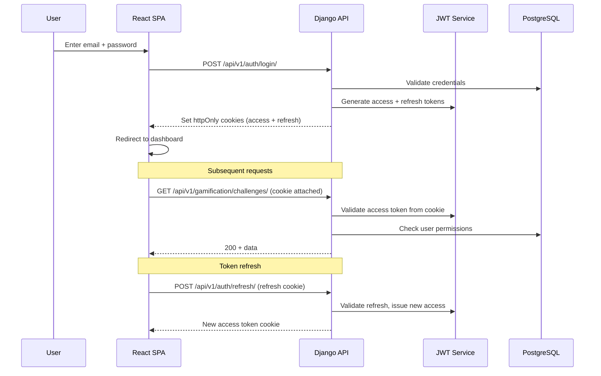

### 8.2 Role Permission Matrix

| Resource | Admin | ESG Manager | Department Head | Employee |
|---|---|---|---|---|
| **Departments** | CRUD | Read | Read (own) | Read (own) |
| **Employees** | CRUD | Read | Read (own dept) | Read (self) |
| **Site Settings** | CRUD | Read | — | — |
| **Emission Factors** | CRUD | CRUD | Read | Read |
| **Carbon Transactions** | CRUD | CRUD | Read (own dept) | Read (own dept) |
| **CSR Activities** | CRUD | CRUD | CRUD (own dept) | Read |
| **Employee Participation** | CRUD | Approve/Reject | Approve/Reject (own dept) | Create (self), Read (self) |
| **Challenges** | CRUD | CRUD | Read | Read, Participate |
| **Challenge Participation** | CRUD | Approve/Reject | Approve/Reject (own dept) | Create (self), Read (self) |
| **Policies** | CRUD | CRUD | Read | Read, Acknowledge |
| **Audits** | CRUD | CRUD | Read (own dept) | — |
| **Compliance Issues** | CRUD | CRUD | Read/Update (own dept) | Read/Update (if owner) |
| **Badges** | CRUD | CRUD | Read | Read (own) |
| **Badge Grant (manual)** | Grant any | Grant (per allowance) | Grant (per allowance) | — |
| **Rewards** | CRUD | CRUD | Read | Read, Redeem |
| **Reports** | All | All | Own dept filter | Own data |
| **Leaderboard** | All | All | All | All (read-only) |

### 8.3 Anti-Gaming Permission Rules

```python
# Enforced in permissions.py — these are non-negotiable
class CannotSelfApprove(BasePermission):
    """No employee can approve their own CSR or Challenge participation."""
    def has_object_permission(self, request, view, obj):
        if view.action in ('approve', 'reject'):
            return request.user.employee != obj.employee
        return True

class CannotExceedBadgeLimit(BasePermission):
    """Manual badge grants respect the Badge's limitation_number per period."""
    ...
```

---

## 9. Event-Driven Architecture

### 9.1 Signal Registry

All side effects are triggered via Django signals. This keeps the primary action clean and makes the system auditable.

| Signal | Sender | Handlers | Side Effects |
|---|---|---|---|
| `participation_approved` | `SocialService` | GamificationService, NotificationService, ScoringService | Check challenge goals, send notification, queue score recalc |
| `challenge_completed` | `GamificationService` | BadgeService, NotificationService, ScoringService | Award XP, check badges, send notification, update leaderboard |
| `xp_awarded` | `GamificationService` | BadgeService | Evaluate auto-unlock badge rules |
| `badge_awarded` | `BadgeService` | NotificationService | Send badge unlock notification |
| `reward_redeemed` | `GamificationService` | NotificationService | Send confirmation to employee + admin |
| `compliance_issue_created` | `GovernanceService` | NotificationService | Notify owner + ESG manager |
| `compliance_issue_overdue` | `CeleryTask` | NotificationService | Escalation notifications |
| `carbon_transaction_created` | `EnvironmentalService` | ScoringService | Queue environmental score recalc |
| `policy_acknowledged` | `GovernanceService` | GamificationService, ScoringService | Check policy-related goals, update governance score |
| `score_calculated` | `ScoringService` | NotificationService | Notify if score dropped significantly |

### 9.2 Signal Implementation Pattern

```python
# apps/gamification/signals.py

from django.dispatch import Signal, receiver

# Custom signals
xp_awarded = Signal()        # args: employee, amount, source
badge_awarded = Signal()     # args: employee, badge, award_type
challenge_completed = Signal()  # args: participation

@receiver(xp_awarded)
def check_badge_unlock_on_xp(sender, employee, amount, **kwargs):
    """When XP is awarded, check if any badges should auto-unlock."""
    from .services import badge_service
    if SiteSettings.get().badge_auto_award_enabled:
        badge_service.evaluate_badges(employee)

@receiver(badge_awarded)
def notify_badge_unlock(sender, employee, badge, **kwargs):
    """When a badge is awarded, send notification."""
    from apps.notifications.services import notification_service
    notification_service.send(
        recipient=employee,
        event_type='badge_unlocked',
        context={'badge_name': badge.name}
    )
```

---

## 10. Scoring Engine

### 10.1 Score Calculation Logic

```python
# apps/scoring/engine.py

class ScoringEngine:
    """
    Calculates Department Scores as point-in-time records.
    NEVER updates existing scores — always appends new records.
    """

    def calculate_department_score(self, department, period_start, period_end):
        settings = SiteSettings.get()

        env_score = self._calc_environmental(department, period_start, period_end)
        soc_score = self._calc_social(department, period_start, period_end)
        gov_score = self._calc_governance(department, period_start, period_end)

        total = (
            env_score * settings.environmental_weight +
            soc_score * settings.social_weight +
            gov_score * settings.governance_weight
        )

        # APPEND — never update
        return DepartmentScore.objects.create(
            department=department,
            environmental_score=env_score,
            social_score=soc_score,
            governance_score=gov_score,
            total_score=total,
            period_start=period_start,
            period_end=period_end,
            calculated_at=timezone.now(),
        )

    def calculate_overall_esg(self, period_start, period_end):
        """Weighted average of all Department Total Scores."""
        latest_scores = DepartmentScore.objects.filter(
            period_start=period_start, period_end=period_end
        ).values('department').annotate(
            latest=Max('calculated_at')
        )
        # ... aggregate into overall score
```

### 10.2 Sub-Score Calculation Components

| Sub-Score | Inputs | Formula |
|---|---|---|
| **Environmental** | Carbon Transactions (reductions), Environmental Goal progress, Product ESG profiles | `(goals_met / total_goals) × 40 + (emission_reduction_pct) × 40 + (products_with_profile_pct) × 20` — normalized to 0-100 |
| **Social** | Approved CSR participations, diversity metrics, training completion | `(participation_rate) × 40 + (diversity_index) × 30 + (training_completion_pct) × 30` — normalized to 0-100 |
| **Governance** | Policy acknowledgement rate, audit pass rate, open compliance issues | `(ack_rate) × 35 + (audit_pass_rate) × 35 - (overdue_issues_penalty) × 30` — clamped to 0-100 |

---

## 11. Notification Pipeline

### 11.1 Architecture

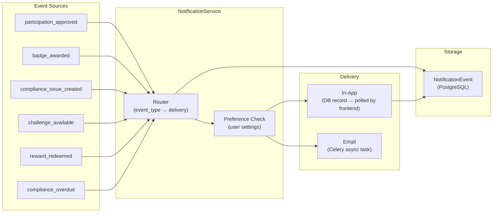

> **Polling model:** The frontend polls `GET /api/notifications/unread/` every 30 seconds via TanStack Query's `refetchInterval`. This replaces WebSocket with zero infrastructure overhead — no Daphne, no Django Channels, no persistent connections. Notifications are stored in PostgreSQL and served as normal REST responses.

### 11.2 Notification Types (Minimum — Floor, Not Ceiling)

| Event | Recipients | In-App | Email |
|---|---|---|---|
| New Compliance Issue | Issue owner, ESG Manager | ✅ | ✅ |
| CSR Participation Approved/Rejected | Participating employee | ✅ | ✅ |
| Challenge Participation Approved/Rejected | Participating employee | ✅ | ✅ |
| Policy Acknowledgement Reminder | Employees who haven't acknowledged | ✅ | ✅ |
| Badge Unlocked | Awarded employee | ✅ | ✅ |
| New Challenge Available | Employees matching assignment rule | ✅ | Optional |
| Reward Redeemed | Employee + fulfillment admin | ✅ | ✅ |
| Compliance Issue Overdue | Issue owner, Dept Head, ESG Manager | ✅ | ✅ |
| Reward Stock Low | ESG Manager, Admin | ✅ | ✅ |

---

## 12. Report Generation Pipeline

### 12.1 Flow

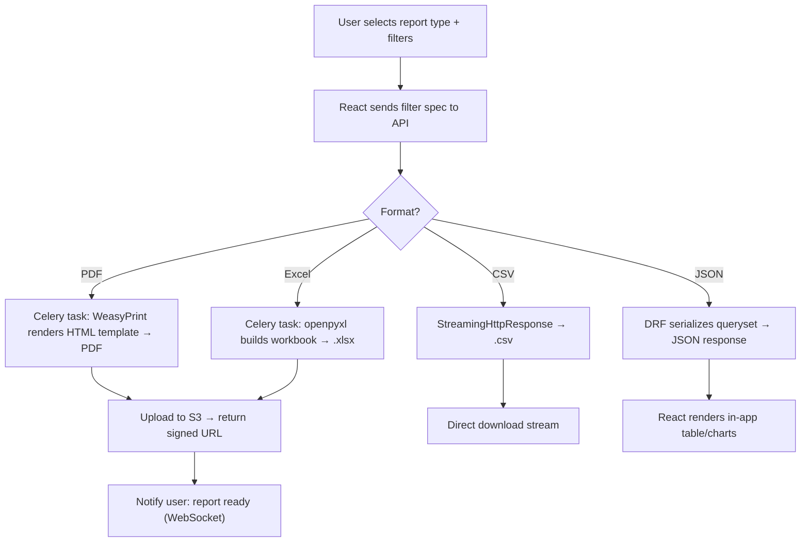

### 12.2 Filter Specification

All reports accept a standardized filter object:

```json
{
  "report_type": "environmental",
  "format": "pdf",
  "filters": {
    "department_ids": ["uuid1", "uuid2"],
    "date_range": { "start": "2026-01-01", "end": "2026-06-30" },
    "module": "environmental",
    "employee_ids": [],
    "challenge_ids": [],
    "category_ids": []
  }
}
```

---

## 13. File Upload & Evidence System

### 13.1 Upload Flow

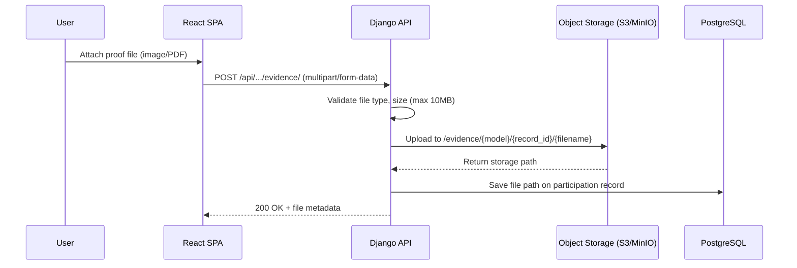

### 13.2 Rules

- Accepted types: `image/jpeg`, `image/png`, `application/pdf` (configurable)
- Max size: 10 MB per file
- Storage path: `evidence/{model_type}/{record_id}/{uuid}_{filename}`
- Files are never stored in the database — only the path reference
- Download: signed URLs with expiry (for security)

---

## 14. Deployment Architecture

### 14.1 Production Setup

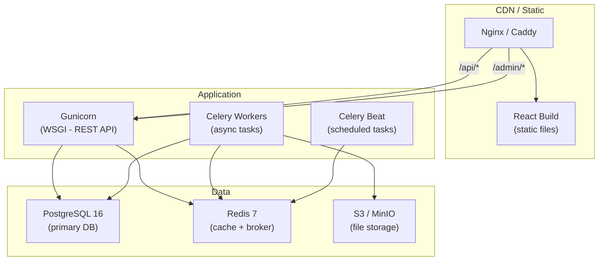

> **Single app server:** With polling instead of WebSocket, Gunicorn is the only application server. No Daphne, no ASGI, no WebSocket upstream — simpler deployment, fewer failure points.

### 14.2 Development Setup

```
# Single command to start everything (docker-compose)
docker-compose up

Services:
  - django:    localhost:8000  (runserver with hot reload)
  - react:     localhost:5173  (vite dev server with HMR)
  - postgres:  localhost:5432
  - redis:     localhost:6379
  - celery:    (worker process)
  - minio:     localhost:9000  (S3-compatible for local dev)
```

---

## 15. Error Handling & Resilience

### 15.1 Error Hierarchy

```python
# common/exceptions.py

class EcoSphereError(Exception):
    """Base exception for all EcoSphere business errors."""
    status_code = 400

class InsufficientPointsError(EcoSphereError):
    code = "INSUFFICIENT_POINTS"

class OutOfStockError(EcoSphereError):
    code = "OUT_OF_STOCK"

class SelfApprovalError(EcoSphereError):
    code = "SELF_APPROVAL_NOT_ALLOWED"
    status_code = 403

class EvidenceRequiredError(EcoSphereError):
    code = "EVIDENCE_REQUIRED"

class InvalidStateTransitionError(EcoSphereError):
    code = "INVALID_STATE_TRANSITION"
```

### 15.2 Retry Strategy (Celery Tasks)

| Task Type | Retry | Max Retries | Backoff |
|---|---|---|---|
| Email notification | Yes | 3 | Exponential (30s, 60s, 120s) |
| Report generation | Yes | 2 | Fixed (60s) |
| Score recalculation | Yes | 3 | Exponential |
| Compliance check | No | — | Runs again next scheduled cycle |

---

## 16. Security Architecture

### 16.1 Security Measures

| Layer | Measure |
|---|---|
| **Transport** | HTTPS everywhere (TLS 1.3) |
| **Auth** | JWT in httpOnly, Secure, SameSite=Strict cookies |
| **CSRF** | Django CSRF middleware + SameSite cookies |
| **CORS** | Whitelist only the React SPA origin |
| **Input** | DRF serializer validation + Django model validation + DB constraints |
| **SQL Injection** | Django ORM (parameterized queries) — no raw SQL |
| **File Upload** | Type validation, size limits, virus scanning (optional), private S3 bucket |
| **Rate Limiting** | django-ratelimit on auth endpoints (5 attempts/minute) |
| **Secrets** | Environment variables via `.env` — never in code |
| **Audit Log** | All state changes logged with actor, timestamp, before/after values |

---

## Appendix: Key Decisions Log

| Decision | Chosen | Rationale |
|---|---|---|
| Architecture style | Modular monolith | Single team, shared DB, internal app — microservices add complexity with no benefit |
| API style | REST | Simpler than GraphQL for this domain shape; CRUD-heavy with well-defined resources |
| Auth mechanism | JWT in httpOnly cookies | More secure than localStorage tokens; works with SSR if ever needed |
| Score storage | Append-only | ESG compliance requires historical auditability — can't overwrite past scores |
| Side-effect pattern | Django signals | Decouples business events from their consequences; easy to test independently |
| File storage | S3-compatible object storage | Files don't belong in the database; S3 is cheap, scalable, and CDN-friendly |
| Task queue | Celery + Redis | Proven, mature, handles both async tasks and periodic scheduling |
| Real-time notifications | Polling (30s interval) | No WebSocket needed — internal dashboard, no sub-second urgency. Eliminates Daphne/Channels/ASGI complexity. TanStack Query `refetchInterval` handles it in one line |
