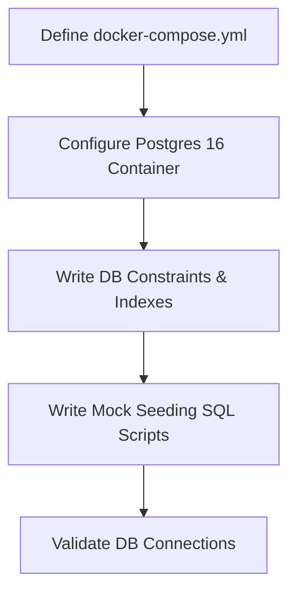
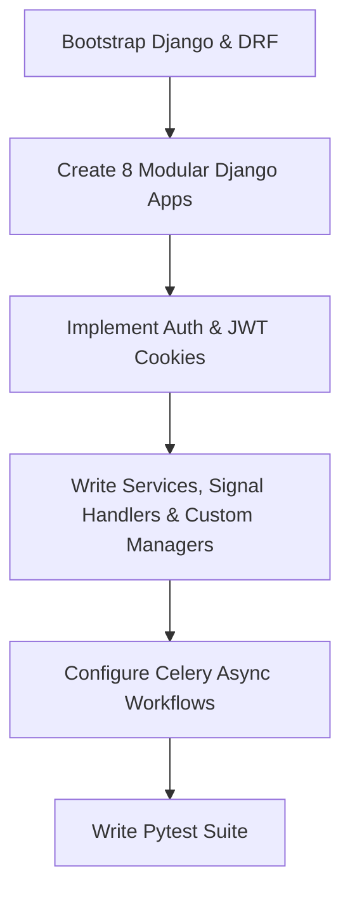
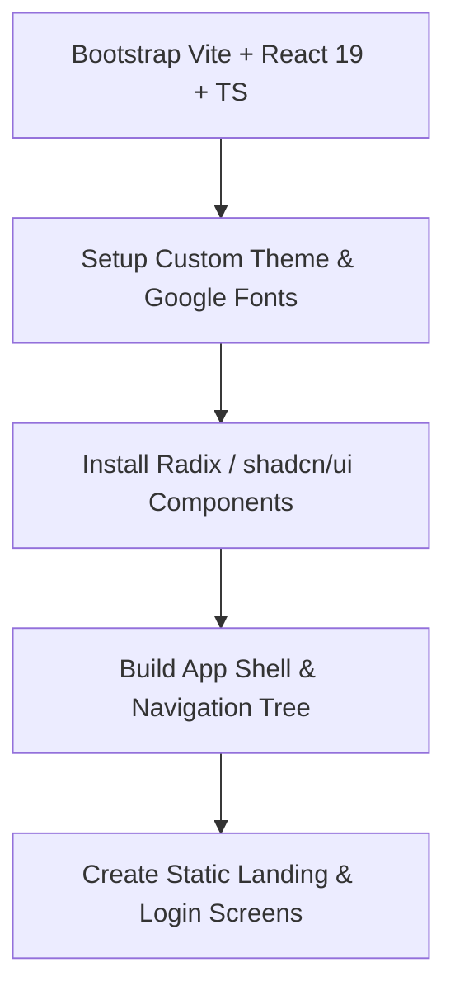
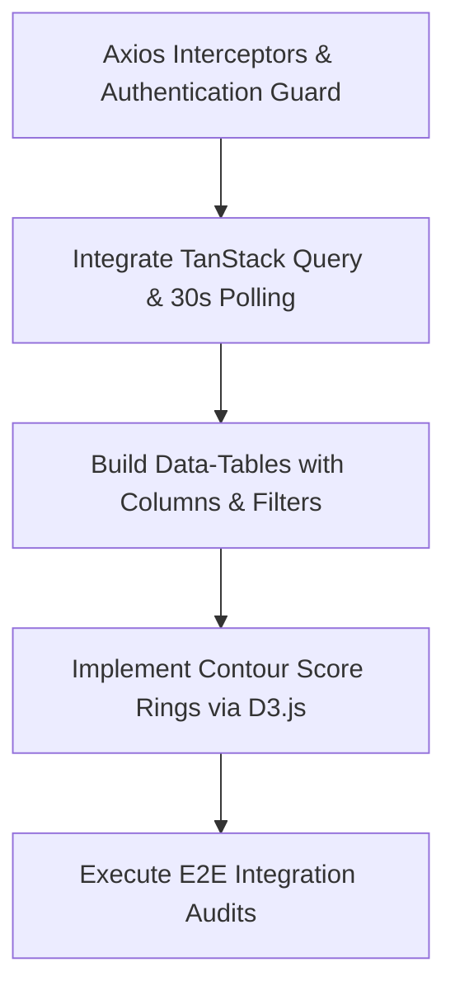
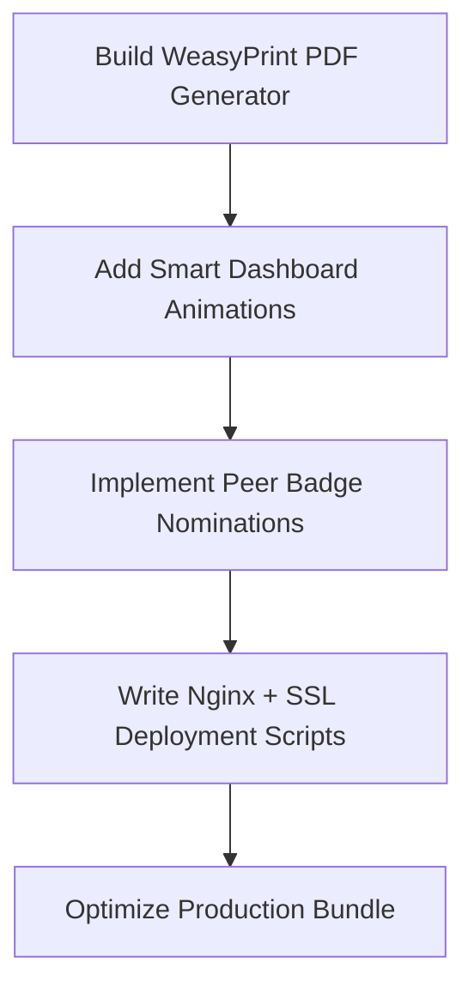

# EcoSphere ESG Management Platform — Phased Implementation Plan

This plan details the step-by-step roadmap for developing and integrating EcoSphere. The project is divided into 3 main folders under the repository root `EcoSphere_Odoo/`:
*   `database/` — Docker setup, PostgreSQL schemas, seeds, constraints, and index migrations.
*   `backend/` — Django 5.2 LTS, Django REST Framework, Celery, and tests.
*   `frontend/` — Vite 6, React 19, TypeScript, TanStack Query, and UI components.

---

## 1. Team Roles & Responsibilities Matrix

| Name | Role | Primary Domain | Core Focus Areas |
| :--- | :--- | :--- | :--- |
| **Atharva** | Team Leader | Integration & Governance | System architecture coordination, code reviews, deployment configuration, and verification of calculations (Scoring Engine). |
| **Suraj** | Backend Developer | Business Logic & API | Django REST Framework, views, custom services, Django signal handlers, Celery task workflows, and pytest suite. |
| **Rohit** | Frontend Developer | UI/UX & Client Logic | React components, routing, CSS custom properties (visual identity), D3 Score Rings, and TanStack query polling/caching. |
| **Shubham** | Database Admin | Storage & Infrastructure | PostgreSQL setup, schemas, raw DB constraints, indexes, mock seeding, and Redis message broker setup. |

---

## 2. Phased Implementation Roadmap

### Phase 1: Environment & Database Setup
*   **Goal:** Establish local development environments, configure Docker container services, lock down the DB schema, and run migrations/seeds.
*   **Folder Focus:** `database/` and base configuration of `backend/`

#### Step-by-Step Task Breakdown
1.  **[Shubham / Atharva] Setup Docker Infrastructure:**
    *   Create a base `docker-compose.yml` in the root folder with services: `postgres` (PostgreSQL 16), `redis` (Redis 7), and `minio` (local S3 emulation).
    *   Expose appropriate development ports.
2.  **[Shubham] Initialize PostgreSQL Schemas & Migration Config:**
    *   Write the initial raw SQL table structures in `database/init.sql` matching the 24 tables in Section 5.1 of `architecture.md`.
    *   Note: While Django ORM will manage migration files, Shubham writes the baseline SQL statements to verify DB constraints.
3.  **[Shubham] Database Constraints & Indexes Implementation:**
    *   Implement and test the SQL CHECK constraints (e.g., `chk_xp_non_negative`, `chk_points_non_negative`, `chk_weights_sum`).
    *   Implement index configurations to speed up high-frequency query joins (e.g., `idx_carbon_tx_dept_date`, `idx_product_esg_profile_product`).
4.  **[Shubham / Suraj] Data Seeding & Mock Scenarios:**
    *   Create mock SQL datasets in `database/seeds/` simulating departments (Logistics, Manufacturing, Corporate), carbon factors, initial challenges, and demo employees.

---

### Phase 2: Backend Architecture & Core API Endpoints
*   **Goal:** Bootstrap the modular Django framework, implement service layers, configure simple JWT auth, and verify with unit tests.
*   **Folder Focus:** `backend/`

#### Step-by-Step Task Breakdown
1.  **[Suraj] Modular Django Monolith Setup:**
    *   Initialize Django 5.2 project using standard configs and virtual environments.
    *   Create 8 separate Django apps matching the domain boundaries: `core`, `environmental`, `social`, `governance`, `gamification`, `scoring`, `notifications`, `reports`.
2.  **[Suraj / Shubham] Auth & Permission Setup:**
    *   Integrate `djangorestframework-simplejwt` to handle JWT authentication.
    *   Configure access and refresh tokens to be returned via secure, httpOnly cookies.
    *   Write custom DRF permissions (e.g., `CannotSelfApprove` to prevent gaming).
3.  **[Suraj] Business Logic Service Layer:**
    *   Write service-layer architectures inside `services.py` for each module (e.g., `approve_participation`, `redeem_reward`).
    *   Implement custom QuerySet managers to wrap relational queries (e.g., fetching leaderboard ranks).
4.  **[Suraj / Atharva] Django Signals & Decoupling:**
    *   Create the registry in `signals.py` to process async side effects (e.g., `participation_approved` triggers the XP checks and notification queues).
5.  **[Suraj / Shubham] Celery Integration:**
    *   Initialize Celery 5.4 inside the Django project.
    *   Write Celery beat schedules for check jobs (e.g., checking for overdue compliance issues daily).
6.  **[Suraj] Backend Testing Suite:**
    *   Setup `pytest-django` and `factory-boy`.
    *   Write unit tests for the scoring engine formulas and concurrency redemptions.

---

### Phase 3: Core Frontend Layout & Pre-Auth UI
*   **Goal:** Setup React-Vite workspace, code static layouts matching brand typography (serif/sans/mono mix) and color variables.
*   **Folder Focus:** `frontend/`

#### Step-by-Step Task Breakdown
1.  **[Rohit] Frontend Workspace Initialization:**
    *   Create Vite template with React 19 and strict TypeScript.
    *   Setup `React Router 7` configuration.
2.  **[Rohit] Styling Variables & Fonts Config:**
    *   Add google font link tags (Fraunces, Inter, IBM Plex Mono) to index.html.
    *   Define core color CSS variables in `index.css` (Sage-tinted `Field Paper` background, `Ledger Ink` text, module colors Canopy Green, Ochre Clay, Slate Blue, Signal Gold).
3.  **[Rohit] Component Primitives Setup:**
    *   Bootstrap `shadcn/ui` and Radix. Add shared primitives (Card, Table, Dialog, Dropdown, Tabs, Tooltip).
4.  **[Rohit] Collapsible Sidebar & Navigation Tab Layout:**
    *   Implement the main App Shell including top-bar search, user settings popover, and collapsible sidebar menu with custom visual states for each module.
5.  **[Rohit] Pre-Auth Mock Screens:**
    *   Build the dark-mode landing page (`/`) showing the static Score Ring graphic.
    *   Build the card-based login page (`/login`) with input error validation styles.

---

### Phase 4: Full Integration & Dynamic UI
*   **Goal:** Connect backend endpoints to frontend views, implement TanStack query caching/polling, construct data tables with filters, and write E2E test runs.
*   **Folder Focus:** `frontend/` and integration tests

#### Step-by-Step Task Breakdown
1.  **[Rohit / Suraj] Authentication Guard & Cookie Binding:**
    *   Implement interceptors in Axios to attach credentials to REST queries automatically.
    *   Write frontend auth routes ensuring unauthenticated routes redirect to `/login`.
2.  **[Rohit] Polling Notification Bell & Sonner Toasts:**
    *   Implement TanStack Query configuration to poll `GET /api/notifications/unread/` every 30 seconds.
    *   Bind unread count to the nav bell and display new items as Sonner notifications.
3.  **[Rohit] Advanced Data-Tables:**
    *   Implement `TanStack Table` wrapper components showing sorting icons, inline pagination, row detail views, and filtering dropdowns for the 6 categories.
4.  **[Rohit / Atharva] Contour Score Rings Drawing:**
    *   Utilize D3.js (or customized inline SVG arcs) to render the hand-drawn-looking concentric rings on the dashboard.
5.  **[Atharva / Rohit / Suraj] Cross-system Workflows E2E:**
    *   Validate the volunteering approval chain: Employee logs volunteering details $\rightarrow$ Department head receives and approves $\rightarrow$ Employee points counter updates $\rightarrow$ Leaderboard highlights the changes.

---

### Phase 5: Refinement, Advanced Features & Innovation
*   **Goal:** Polish UX details, add WeasyPrint PDF report generators, implement automated score tracking, build deployment scripts, and add advanced visual aesthetics.
*   **Folder Focus:** `backend/`, `frontend/`, and devops pipeline

#### Step-by-Step Task Breakdown
1.  **[Suraj / Shubham] PDF / Excel Report Exporters:**
    *   Integrate `WeasyPrint` templates styled with brand assets (Fraunces serif) to generate printable PDFs.
    *   Use `openpyxl` to build formatted Excel workbooks.
2.  **[Rohit] Rich Visual Aesthetics & Animations:**
    *   Add micro-animations (e.g. score ring filling on load, points indicator counting up, badge awards displaying a restrained celebration pulse).
3.  **[Suraj / Rohit / Atharva] Advanced Gamification Logic:**
    *   Implement peer-grantable badges with allowance limit controls per month.
    *   Build historical scoring charts showing Department total trends.
4.  **[Atharva / Shubham] Nginx & Production DevOps Configs:**
    *   Write `nginx.conf` routing client-side requests to compiled static folders and API query paths (`/api/*`) to Gunicorn.
    *   Configure production environment variables using `.env` variables.

---

## 3. Collaboration & Branching Strategy

To keep the development organized and prevent conflicts across folders, the team will follow this workflow:

1.  **Repository Setup:** Root contains `database/`, `backend/`, and `frontend/` folders.
2.  **Branch Convention:**
    *   `db/*` for Shubham's data changes.
    *   `backend/*` for Suraj's logic work.
    *   `frontend/*` for Rohit's interface updates.
    *   `main` — production-ready code.
3.  **Review Checkpoints (Managed by Atharva):**
    *   Shubham submits DB designs $\rightarrow$ Approved $\rightarrow$ Suraj starts models.
    *   Suraj writes API endpoints $\rightarrow$ Deploys local docs $\rightarrow$ Rohit integrates.
    *   Weekly syncs to run full integration checks.
