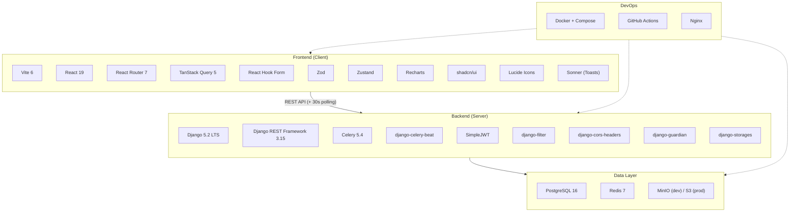
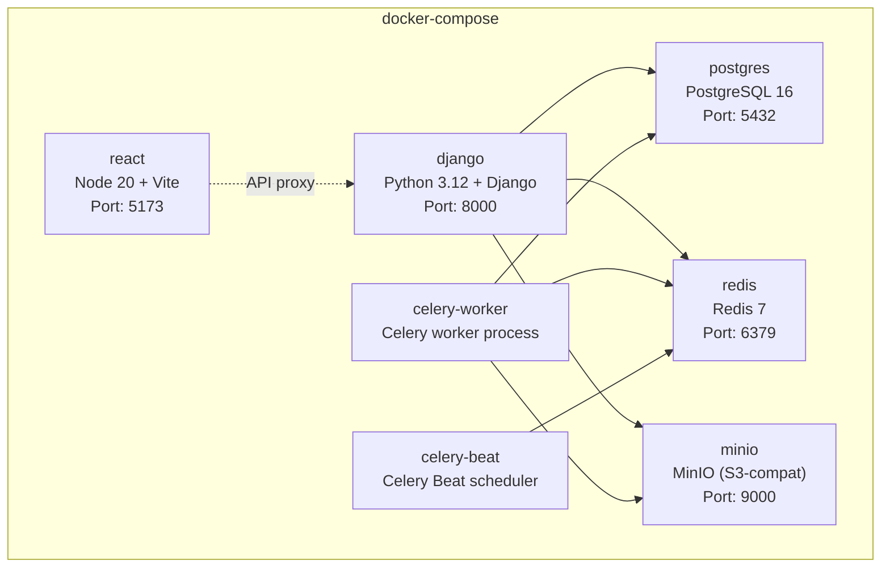
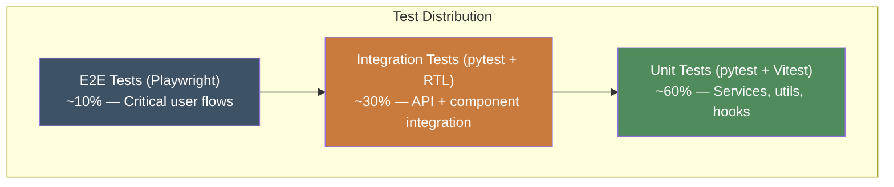

# EcoSphere — Tech Stack Specification

> **Audience:** AI agents and human developers implementing EcoSphere.
> **Purpose:** Exact specification of every technology, library, and tool used in the project. The base stack defined here is **locked** — additions are allowed, but replacements require explicit team approval and an update to this document.
> **Companion docs:** `architecture.md` (system design), `rules.md` (business rules), `gamification.md` (game mechanics), `brand.md` (visual identity).

---

## Table of Contents

1. [Stack Overview](#1-stack-overview)
2. [Backend Stack (Django)](#2-backend-stack-django)
3. [Frontend Stack (React)](#3-frontend-stack-react)
4. [Database & Storage](#4-database--storage)
5. [Infrastructure & DevOps](#5-infrastructure--devops)
6. [Development Tools](#6-development-tools)
7. [Testing Stack](#7-testing-stack)
8. [Version Matrix](#8-version-matrix)
9. [Package Installation Reference](#9-package-installation-reference)
10. [Extension Policy](#10-extension-policy)

---

## 1. Stack Overview



---

## 2. Backend Stack (Django)

### 2.1 Core Framework

| Package | Version | Purpose | Why this, not alternatives |
|---|---|---|---|
| **Python** | `3.12+` | Runtime | Latest stable, best performance, required for Django 5.2 |
| **Django** | `5.2 LTS` | Web framework | Long-term support until April 2028. Monolith-friendly, ORM, admin, auth built-in |
| **Django REST Framework** | `3.15+` | REST API layer | Industry standard for Django APIs. ViewSets, serializers, permissions, pagination |
| **Gunicorn** | `22+` | WSGI server (production) | Standard Python WSGI server. Runs Django for HTTP/REST |

### 2.2 Authentication & Authorization

| Package | Version | Purpose | Configuration |
|---|---|---|---|
| **djangorestframework-simplejwt** | `5.3+` | JWT authentication | Access token: 15min, Refresh token: 7 days, httpOnly cookies |
| **django-guardian** | `2.4+` | Object-level permissions | Per-department, per-record access control for Dept Heads |
| **django-cors-headers** | `4.4+` | CORS management | Whitelist React dev server + production domain only |

### 2.3 Data & Validation

| Package | Version | Purpose | Notes |
|---|---|---|---|
| **psycopg** | `3.2+` | PostgreSQL adapter | Modern async-capable Postgres driver (psycopg3, not psycopg2) |
| **django-filter** | `24.3+` | QuerySet filtering | Declarative filter classes for all list endpoints |
| **django-money** | `3.5+` | Decimal precision | Optional — for precise financial/carbon values if needed |

### 2.4 Async Tasks & Scheduling

| Package | Version | Purpose | Notes |
|---|---|---|---|
| **Celery** | `5.4+` | Async task queue | Email sending, report generation, score recalculation |
| **django-celery-beat** | `2.7+` | Periodic task scheduling | Compliance overdue checks (daily), recurring challenges |
| **Redis** (as broker) | `7+` | Message broker | Also used for caching |


### 2.6 File Storage

| Package | Version | Purpose | Notes |
|---|---|---|---|
| **django-storages** | `1.14+` | Cloud storage abstraction | Abstracts S3/GCS/Azure Blob behind Django's file API |
| **boto3** | `1.35+` | AWS S3 SDK | Used by django-storages for S3-compatible storage |

### 2.7 Report Generation

| Package | Version | Purpose | Notes |
|---|---|---|---|
| **WeasyPrint** | `62+` | PDF generation | HTML/CSS → PDF. Uses the same brand templates for reports |
| **openpyxl** | `3.1+` | Excel export | `.xlsx` generation with formatting, charts, multiple sheets |
| *(Python stdlib)* `csv` | — | CSV export | Built-in, no dependency needed |

### 2.8 Email

| Package | Version | Purpose | Notes |
|---|---|---|---|
| **Django email backend** | built-in | Email sending | SMTP for dev, AWS SES / SendGrid for production |
| **django-anymail** | `12+` | Transactional email | Optional — for SES/SendGrid/Mailgun integration with tracking |

### 2.9 Utilities

| Package | Version | Purpose | Notes |
|---|---|---|---|
| **django-environ** | `0.11+` | Environment config | `.env` file parsing for settings (secrets, DB URLs) |
| **django-extensions** | `3.2+` | Dev utilities | `shell_plus`, `show_urls`, `graph_models` |
| **django-ratelimit** | `4.1+` | Rate limiting | Protect auth endpoints (5 attempts/minute) |
| **whitenoise** | `6.7+` | Static file serving | Serves Django admin static files in production without Nginx |

---

## 3. Frontend Stack (React)

### 3.1 Core Framework

| Package | Version | Purpose | Why this, not alternatives |
|---|---|---|---|
| **Node.js** | `20 LTS` | Runtime | Required for Vite dev server and build tooling |
| **Vite** | `6+` | Build tool + dev server | Instant HMR, fast builds, zero-config. No SSR needed |
| **React** | `19+` | UI library | Largest ecosystem for dashboard components |
| **TypeScript** | `5.6+` | Language | Type safety across all components, hooks, and API calls |

### 3.2 Routing & Data

| Package | Version | Purpose | Notes |
|---|---|---|---|
| **React Router** | `7+` | Client-side routing | File-based or config-based routes. Handles auth guards |
| **TanStack Query** | `5+` | Server state management | Caching, refetching, optimistic updates for all API data |
| **Axios** | `1.7+` | HTTP client | Request/response interceptors for JWT refresh, error handling |
| **Zustand** | `5+` | Client state | Lightweight — for UI state (sidebar open, theme, modals), NOT server data |

### 3.3 Forms & Validation

| Package | Version | Purpose | Notes |
|---|---|---|---|
| **React Hook Form** | `7.53+` | Form management | Uncontrolled forms, minimal re-renders, integrates with Zod |
| **Zod** | `3.23+` | Schema validation | Shared validation schemas between forms and API response parsing |
| **@hookform/resolvers** | `3.9+` | RHF + Zod bridge | Connects Zod schemas to React Hook Form |

### 3.4 UI Components

| Package | Version | Purpose | Notes |
|---|---|---|---|
| **shadcn/ui** | latest | Component library | NOT a dependency — copy-paste components built on Radix. Fully customizable to EcoSphere brand |
| **Radix UI** | latest | Primitive components | Accessible, unstyled primitives (Dialog, Dropdown, etc.) — installed via shadcn |
| **Lucide React** | `0.460+` | Icons | Line icons matching the brand guide (1.5-2px stroke, geometric) |
| **class-variance-authority** | `0.7+` | Variant styling | Type-safe component variants (button sizes, card styles) |
| **clsx** + **tailwind-merge** | latest | Class utilities | Conditional class names (used internally by shadcn) |

> **Note on CSS:** shadcn/ui uses Tailwind CSS internally. This is acceptable because shadcn components are copied into the project and fully customizable. All custom application styles (brand colors, Contour Score Rings, module theming) should be written in vanilla CSS or CSS modules, with Tailwind only used within shadcn component files.

### 3.5 Data Visualization

| Package | Version | Purpose | Notes |
|---|---|---|---|
| **Recharts** | `2.13+` | Charts | Bar, line, area, pie charts for dashboards and reports. Built on D3 |
| **D3** | `7+` | Custom visualizations | For the Contour Score Ring and any custom SVG visualizations |
| **@nivo/core** | `0.87+` | Alternative/supplementary | Optional — richer chart types (heatmaps, radar) if Recharts isn't sufficient |

### 3.6 Tables

| Package | Version | Purpose | Notes |
|---|---|---|---|
| **TanStack Table** | `8.20+` | Data tables | Headless — sorting, filtering, pagination, column visibility. Style with shadcn |

### 3.7 Notifications

| Package | Version | Purpose | Notes |
|---|---|---|---|
| **TanStack Query polling** | (see 3.2) | In-app notifications | `refetchInterval: 30_000` on `/api/notifications/unread/` — zero extra infrastructure |
| **Sonner** | `1.7+` | Toast notifications | Minimal, accessible toasts for displaying polled notifications |
| **react-hot-toast** | `2.4+` | Alternative toasts | Backup option if Sonner doesn't meet needs |

### 3.8 Utilities

| Package | Version | Purpose | Notes |
|---|---|---|---|
| **date-fns** | `4+` | Date manipulation | Lightweight date formatting, comparison (NOT moment.js) |
| **zod** | (see 3.3) | API response validation | Parse and validate API responses for type safety |
| **react-dropzone** | `14.3+` | File upload UI | Drag-and-drop file upload for evidence/proof |

### 3.9 Fonts (from Brand Guide)

| Font | Source | Role |
|---|---|---|
| **Fraunces** | Google Fonts | Display (H1, hero numbers, module titles) |
| **Inter** | Google Fonts | Body / UI (paragraphs, labels, nav, buttons) |
| **IBM Plex Mono** | Google Fonts | Data / Ledger (scores, numbers, tables, IDs) |

---

## 4. Database & Storage

### 4.1 Primary Database

| Technology | Version | Purpose | Configuration |
|---|---|---|---|
| **PostgreSQL** | `16+` | Primary relational database | ACID transactions, CHECK constraints, row-level locking, JSON fields for flexible config |

**Key PostgreSQL features used:**
- `CHECK` constraints for non-negative balances/stock
- `SELECT ... FOR UPDATE` for atomic reward redemption
- `JSONB` fields for flexible Goal Definition rules and notification metadata
- Indexes on high-frequency query patterns (see `architecture.md` §5.3)
- UUID primary keys (`gen_random_uuid()`)

### 4.2 Cache & Message Broker

| Technology | Version | Purpose | Configuration |
|---|---|---|---|
| **Redis** | `7+` | Cache + Celery broker | Single Redis instance with logical databases (db0=cache, db1=celery) |

**Redis usage:**
- **Cache:** Leaderboard rankings, frequently-read settings, session data
- **Broker:** Celery task queue (email, reports, score recalc)

### 4.3 Object Storage

| Technology | Environment | Purpose |
|---|---|---|
| **MinIO** | Development | S3-compatible object storage for local development |
| **AWS S3** / **GCS** / **Azure Blob** | Production | Production file storage (evidence, reports, exports) |

**Bucket structure:**
```
ecosphere-storage/
├── evidence/
│   ├── csr-participation/{id}/{file}
│   └── challenge-participation/{id}/{file}
├── reports/
│   ├── generated/{id}.pdf
│   └── generated/{id}.xlsx
├── badges/
│   └── icons/{badge_id}.svg
└── exports/
    └── {user_id}/{timestamp}_{report_name}.{ext}
```

---

## 5. Infrastructure & DevOps

### 5.1 Containerization

| Technology | Version | Purpose |
|---|---|---|
| **Docker** | `27+` | Container runtime |
| **Docker Compose** | `2.30+` | Multi-container orchestration (dev + staging) |

### 5.2 docker-compose.yml Services



### 5.3 Web Server (Production)

| Technology | Version | Purpose |
|---|---|---|
| **Nginx** | `1.27+` | Reverse proxy, static file serving, SSL termination |
| **Gunicorn** | `22+` | WSGI server for Django (REST API) — the only app server needed |

**Nginx routing:**
```
/              → React static files (built by Vite)
/api/*         → Gunicorn (Django REST API)
/admin/*       → Gunicorn (Django Admin)
/media/*       → S3 signed URLs (redirect)
```

> **Note:** No Daphne/ASGI server needed. With polling-based notifications, Gunicorn serves everything. Simpler deployment, fewer processes, lower resource usage.

### 5.4 CI/CD

| Technology | Purpose |
|---|---|
| **GitHub Actions** | CI pipeline: lint, test, build, deploy |
| **Pre-commit hooks** | Local: ruff, black, mypy, eslint, prettier |

---

## 6. Development Tools

### 6.1 Backend Development

| Tool | Purpose | Notes |
|---|---|---|
| **Ruff** | Python linting + formatting | Replaces flake8, isort, black (faster, single tool) |
| **Black** | Python code formatting | Backup formatter (Ruff can also format) |
| **mypy** | Static type checking | Enforce type hints on services and models |
| **django-debug-toolbar** | Request debugging | SQL queries, cache hits, template rendering (dev only) |
| **django-extensions** | Dev utilities | `shell_plus`, `show_urls`, model graph generation |
| **ipython** | Enhanced shell | Better REPL for `manage.py shell` |

### 6.2 Frontend Development

| Tool | Purpose | Notes |
|---|---|---|
| **ESLint** | JavaScript/TypeScript linting | `@typescript-eslint` rules |
| **Prettier** | Code formatting | Consistent formatting across all frontend files |
| **TypeScript** | Static type checking | Strict mode enabled |

### 6.3 API Development

| Tool | Purpose | Notes |
|---|---|---|
| **drf-spectacular** | OpenAPI schema generation | Auto-generates OpenAPI 3.0 spec from DRF views |
| **Swagger UI / Redoc** | API documentation | Interactive API docs at `/api/docs/` |

---

## 7. Testing Stack

### 7.1 Backend Testing

| Tool | Purpose | Notes |
|---|---|---|
| **pytest** | Test runner | With `pytest-django` for Django integration |
| **pytest-django** | Django test utilities | DB fixtures, client, settings override |
| **factory-boy** | Test data factories | Model factories for consistent test data |
| **pytest-cov** | Coverage reporting | Minimum coverage target: 80% |

| **responses** / **httpretty** | HTTP mocking | Mock external API calls (email, S3) |

### 7.2 Frontend Testing

| Tool | Purpose | Notes |
|---|---|---|
| **Vitest** | Unit test runner | Vite-native, fast, compatible with Jest API |
| **React Testing Library** | Component testing | Test behavior, not implementation |
| **MSW** (Mock Service Worker) | API mocking | Intercept network requests in tests |
| **Playwright** | E2E testing | Cross-browser end-to-end tests |

### 7.3 Test Pyramid



---

## 8. Version Matrix

> **Locked versions** — do not change without updating this document.

### Backend

| Package | Minimum Version | Lock File |
|---|---|---|
| Python | 3.12 | `pyproject.toml` |
| Django | 5.2 | `requirements.txt` or `pyproject.toml` |
| djangorestframework | 3.15 | `requirements.txt` |
| djangorestframework-simplejwt | 5.3 | `requirements.txt` |
| celery | 5.4 | `requirements.txt` |
| django-celery-beat | 2.7 | `requirements.txt` |
| django-filter | 24.3 | `requirements.txt` |
| django-cors-headers | 4.4 | `requirements.txt` |
| django-guardian | 2.4 | `requirements.txt` |
| django-storages | 1.14 | `requirements.txt` |
| django-environ | 0.11 | `requirements.txt` |
| django-ratelimit | 4.1 | `requirements.txt` |
| drf-spectacular | 0.27 | `requirements.txt` |
| psycopg | 3.2 | `requirements.txt` |
| gunicorn | 22 | `requirements.txt` |
| boto3 | 1.35 | `requirements.txt` |
| WeasyPrint | 62 | `requirements.txt` |
| openpyxl | 3.1 | `requirements.txt` |
| redis | 5.2 | `requirements.txt` |

### Frontend

| Package | Minimum Version | Lock File |
|---|---|---|
| Node.js | 20 LTS | `.nvmrc` |
| Vite | 6 | `package.json` |
| React | 19 | `package.json` |
| TypeScript | 5.6 | `package.json` |
| React Router | 7 | `package.json` |
| @tanstack/react-query | 5 | `package.json` |
| axios | 1.7 | `package.json` |
| zustand | 5 | `package.json` |
| react-hook-form | 7.53 | `package.json` |
| zod | 3.23 | `package.json` |
| @tanstack/react-table | 8.20 | `package.json` |
| recharts | 2.13 | `package.json` |
| d3 | 7 | `package.json` |
| lucide-react | 0.460 | `package.json` |
| sonner | 1.7 | `package.json` |
| date-fns | 4 | `package.json` |
| react-dropzone | 14.3 | `package.json` |

### Infrastructure

| Technology | Minimum Version |
|---|---|
| PostgreSQL | 16 |
| Redis | 7 |
| Docker | 27 |
| Docker Compose | 2.30 |
| Nginx | 1.27 |
| MinIO | latest |

---

## 9. Package Installation Reference

### 9.1 Backend Setup

```bash
# Create virtual environment
python -m venv .venv
source .venv/bin/activate  # Linux/Mac
# .venv\Scripts\activate   # Windows

# Install dependencies
pip install django==5.2.* \
    djangorestframework>=3.15 \
    djangorestframework-simplejwt>=5.3 \
    celery>=5.4 \
    django-celery-beat>=2.7 \
    django-filter>=24.3 \
    django-cors-headers>=4.4 \
    django-guardian>=2.4 \
    django-storages>=1.14 \
    django-environ>=0.11 \
    django-ratelimit>=4.1 \
    drf-spectacular>=0.27 \
    "psycopg[binary]>=3.2" \
    gunicorn>=22 \
    boto3>=1.35 \
    WeasyPrint>=62 \
    openpyxl>=3.1 \
    redis>=5.2 \
    whitenoise>=6.7

# Dev dependencies
pip install pytest pytest-django factory-boy pytest-cov \
    ruff mypy django-debug-toolbar django-extensions ipython \
    django-anymail
```

### 9.2 Frontend Setup

```bash
# Initialize project
npm create vite@latest frontend -- --template react-ts
cd frontend

# Core dependencies
npm install react-router axios \
    @tanstack/react-query \
    zustand \
    react-hook-form zod @hookform/resolvers \
    @tanstack/react-table \
    recharts d3 @types/d3 \
    lucide-react \
    sonner \
    date-fns \
    react-dropzone \
    class-variance-authority clsx tailwind-merge

# shadcn/ui setup (adds Tailwind + Radix components)
npx shadcn@latest init
# Then add components as needed:
npx shadcn@latest add button card dialog dropdown-menu \
    input label select table tabs badge avatar \
    sheet tooltip popover command separator

# Dev dependencies
npm install -D @types/react @types/react-dom \
    vitest @testing-library/react @testing-library/jest-dom \
    msw playwright \
    eslint prettier \
    @typescript-eslint/eslint-plugin \
    @typescript-eslint/parser
```

---

## 10. Extension Policy

### 10.1 What you CAN add without approval

- Additional shadcn/ui components (they're copy-paste, not dependencies)
- New Celery task types
- Additional Django apps following the established pattern
- Additional chart types from Recharts or Nivo
- Utility libraries (lodash individual functions, uuid, etc.)
- Test utilities and fixtures

### 10.2 What REQUIRES team discussion + this document update

- Replacing any package in the version matrix (e.g., swapping Recharts for Chart.js)
- Adding a new database (e.g., MongoDB alongside PostgreSQL)
- Adding a frontend state manager to replace or supplement Zustand
- Introducing GraphQL (we're REST — switching has API-wide implications)
- Adding SSR or a meta-framework (Next.js, Remix) on top of Vite
- Changing the auth mechanism (JWT → session, OAuth provider, etc.)
- Adding WebSocket or real-time push (e.g., Django Channels, Firebase, Pusher) — polling is the chosen approach

### 10.3 What is EXPLICITLY NOT in this stack

| Not using | Reason |
|---|---|
| **Next.js** | SSR/SSG not needed — internal dashboard behind auth. Adds server complexity alongside Django |
| **GraphQL** | Domain is CRUD-heavy with well-defined resources — REST is simpler and sufficient |
| **MongoDB** | Domain is heavily relational — PostgreSQL is the right choice |
| **Redux** | Zustand is simpler for this scale. Server state lives in TanStack Query, not Redux |
| **Tailwind (standalone)** | Used only internally by shadcn components. Custom app styles use vanilla CSS / CSS modules |
| **Moment.js** | Deprecated. Use date-fns |
| **jQuery** | Not 2012 |
| **Firebase** | Self-hosted stack preferred for ESG data sovereignty |
| **Electron** | Web-only — mobile-responsive is a bonus feature per spec, not a native app |

---

## Appendix: Architecture Decision Records (ADRs)

### ADR-001: Why Django over FastAPI

**Decision:** Django 5.2 LTS
**Context:** Both are Python. FastAPI is faster for pure API throughput.
**Rationale:** EcoSphere needs admin panels, ORM with migrations, built-in auth, signal system, and mature ecosystem. Django provides all of these out of the box. FastAPI would require assembling each piece manually (SQLAlchemy + Alembic + custom admin + custom auth). The API throughput difference is irrelevant at this scale (internal corporate platform).

### ADR-002: Why Vite + React over Next.js

**Decision:** Vite 6 + React 19 (pure SPA)
**Context:** Next.js offers SSR, SSG, API routes.
**Rationale:** EcoSphere is an internal dashboard behind authentication. No SEO, no public pages, no server-side rendering needed. Next.js would add a Node.js server alongside Django — two servers, two deployment targets, zero benefit. Vite gives instant HMR and deploys as static files to any CDN/Nginx.

### ADR-003: Why PostgreSQL over MySQL / SQLite

**Decision:** PostgreSQL 16
**Context:** All are relational databases.
**Rationale:** PostgreSQL offers `CHECK` constraints (critical for non-negative balances), `SELECT FOR UPDATE` (critical for atomic redemptions), JSONB (flexible Goal Definition rules), and superior indexing. Django's ORM supports all three, but PostgreSQL is the only one that enforces all required business constraints at the database level.

### ADR-004: Why shadcn/ui over Material UI / Ant Design

**Decision:** shadcn/ui (copy-paste Radix components)
**Context:** MUI and Ant Design are full component libraries with their own design systems.
**Rationale:** EcoSphere has a specific, custom brand identity (Field Paper colors, Fraunces typography, Contour Score Rings). MUI/Ant impose their own visual language that fights custom branding. shadcn/ui provides unstyled, accessible primitives that we fully own and can style to match the brand guide exactly — with zero "override the library's CSS" battles.

### ADR-005: Why Celery over Django-Q / Huey

**Decision:** Celery 5.4 + django-celery-beat
**Context:** Multiple Python task queue options exist.
**Rationale:** Celery is the industry standard with the largest community, best documentation, and most production battle-testing. django-celery-beat adds database-backed periodic task scheduling (needed for compliance checks, recurring challenges). Celery's retry mechanisms with exponential backoff are critical for email/notification reliability.
