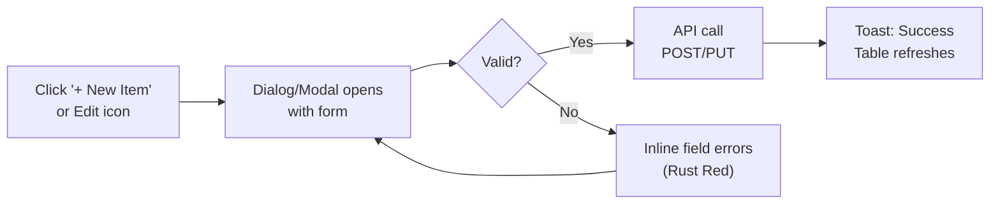
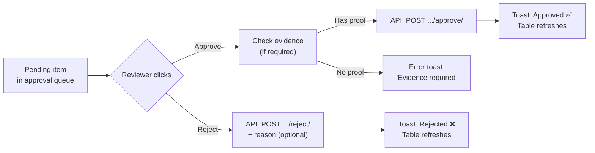

# EcoSphere — UI/UX Specification

> **Audience:** AI agents and human developers building EcoSphere's frontend.
> **Source of truth for:** page structure, navigation, component layout, interaction patterns, and visual specifications.
> **Companion docs:** `brand.md` (visual identity), `architecture.md` (API endpoints), `techstack.md` (libraries), `rules.md` (business rules).
> **Reference wireframe:** `ecosphere UI.png` (this document codifies that wireframe into implementable specs).

---

## Table of Contents

1. [Application Structure](#1-application-structure)
2. [Public Pages (Pre-Auth)](#2-public-pages-pre-auth)
3. [App Shell & Navigation](#3-app-shell--navigation)
4. [Page Specifications](#4-page-specifications)
   - [4.1 Dashboard](#41-dashboard)
   - [4.2 Environmental](#42-environmental)
   - [4.3 Social](#43-social)
   - [4.4 Governance](#44-governance)
   - [4.5 Gamification](#45-gamification)
   - [4.6 Reports](#46-reports)
   - [4.7 Settings](#47-settings)
5. [Shared Components](#5-shared-components)
6. [Color System (Updated from Brand Guide)](#6-color-system)
7. [Interaction Patterns](#7-interaction-patterns)
8. [Responsive Behavior](#8-responsive-behavior)
9. [Accessibility](#9-accessibility)

---

## 1. Application Structure

### 1.1 Route Map

```mermaid
graph TD
    ROOT["/"] --> LANDING["/ — Landing Page"]
    LANDING --> LOGIN["/login — Login Page"]
    LOGIN --> APP["/app — Authenticated Shell"]

    APP --> DASH["/app/dashboard"]

    APP --> ENV["/app/environmental"]
    ENV --> ENV_EF["/app/environmental/emission-factors"]
    ENV --> ENV_PP["/app/environmental/product-profiles"]
    ENV --> ENV_CT["/app/environmental/carbon-transactions"]
    ENV --> ENV_EG["/app/environmental/goals"]

    APP --> SOC["/app/social"]
    SOC --> SOC_CSR["/app/social/csr-activities"]
    SOC --> SOC_EP["/app/social/participation"]
    SOC --> SOC_DIV["/app/social/diversity"]

    APP --> GOV["/app/governance"]
    GOV --> GOV_POL["/app/governance/policies"]
    GOV --> GOV_ACK["/app/governance/acknowledgements"]
    GOV --> GOV_AUD["/app/governance/audits"]
    GOV --> GOV_CI["/app/governance/compliance-issues"]

    APP --> GAM["/app/gamification"]
    GAM --> GAM_CH["/app/gamification/challenges"]
    GAM --> GAM_CP["/app/gamification/participation"]
    GAM --> GAM_BA["/app/gamification/badges"]
    GAM --> GAM_RW["/app/gamification/rewards"]
    GAM --> GAM_LB["/app/gamification/leaderboard"]

    APP --> REP["/app/reports"]
    REP --> REP_ENV["/app/reports/environmental"]
    REP --> REP_SOC["/app/reports/social"]
    REP --> REP_GOV["/app/reports/governance"]
    REP --> REP_SUM["/app/reports/esg-summary"]
    REP --> REP_CUS["/app/reports/custom"]

    APP --> SET["/app/settings"]
    SET --> SET_DEP["/app/settings/departments"]
    SET --> SET_CAT["/app/settings/categories"]
    SET --> SET_CFG["/app/settings/esg-configuration"]
    SET --> SET_NOT["/app/settings/notifications"]
```



### 1.2 Page Access by Role

| Page | Admin | ESG Manager | Dept Head | Employee |
|---|---|---|---|---|
| Landing / Login | ✅ | ✅ | ✅ | ✅ |
| Dashboard | ✅ Full | ✅ Full | ✅ Own dept | ✅ Limited |
| Environmental | ✅ Full CRUD | ✅ Full CRUD | ✅ Read (own dept) | ✅ Read (own dept) |
| Social — CSR Activities | ✅ Full CRUD | ✅ Full CRUD | ✅ CRUD (own dept) | ✅ Read |
| Social — Participation | ✅ All | ✅ Approve/Reject | ✅ Approve (own dept) | ✅ Own only |
| Governance | ✅ Full CRUD | ✅ Full CRUD | ✅ Read (own dept) | ✅ Read/Acknowledge |
| Gamification — Challenges | ✅ Full CRUD | ✅ Full CRUD | ✅ Read | ✅ Read, Join |
| Gamification — Badges | ✅ Full CRUD | ✅ CRUD + Grant | ✅ Read + Grant | ✅ Read (own) |
| Gamification — Rewards | ✅ Full CRUD | ✅ Full CRUD | ✅ Read | ✅ Read, Redeem |
| Gamification — Leaderboard | ✅ | ✅ | ✅ | ✅ |
| Reports | ✅ All | ✅ All | ✅ Own dept | ✅ Own data |
| Settings | ✅ Full | ✅ Read | ❌ | ❌ |

---

## 2. Public Pages (Pre-Auth)

### 2.1 Landing Page (`/`)

The landing page is the first thing users see. It establishes the EcoSphere brand and funnels users to login.

**Layout:**

```
┌─────────────────────────────────────────────────────────────────┐
│  NAVBAR                                                         │
│  ┌──────┐                              ┌──────────┐ ┌────────┐ │
│  │ Logo │  EcoSphere                   │ About    │ │ Login  │ │
│  └──────┘                              └──────────┘ └────────┘ │
├─────────────────────────────────────────────────────────────────┤
│                                                                 │
│  HERO SECTION                                                   │
│  ┌─────────────────────────────────────────────────────────────┐│
│  │                                                             ││
│  │  Measure. Manage. Improve.                                  ││
│  │  Your organization's ESG performance,                       ││
│  │  in one platform.                                           ││
│  │                                                             ││
│  │  ┌──────────────────┐                                       ││
│  │  │  Get Started →   │                                       ││
│  │  └──────────────────┘                                       ││
│  │                                                             ││
│  │  [Contour Score Ring animation — E/S/G rings filling in]    ││
│  │                                                             ││
│  └─────────────────────────────────────────────────────────────┘│
│                                                                 │
│  FEATURE HIGHLIGHTS (3-column grid)                             │
│  ┌──────────────┐ ┌──────────────┐ ┌──────────────┐           │
│  │ 🌿           │ │ 👥           │ │ 🏛️           │           │
│  │ Environmental│ │ Social       │ │ Governance   │           │
│  │ Carbon       │ │ CSR, engage- │ │ Policies,    │           │
│  │ tracking &   │ │ ment, diver- │ │ audits &     │           │
│  │ goals        │ │ sity metrics │ │ compliance   │           │
│  └──────────────┘ └──────────────┘ └──────────────┘           │
│                                                                 │
│  ┌──────────────────────────────┐                              │
│  │ GAMIFICATION CALLOUT         │                              │
│  │ Earn XP. Unlock badges.     │                              │
│  │ Make sustainability a game. │                              │
│  └──────────────────────────────┘                              │
│                                                                 │
│  FOOTER                                                         │
│  EcoSphere © 2026  ·  ESG Management Platform                  │
└─────────────────────────────────────────────────────────────────┘
```

**Design specs:**
- Background: `Ledger Ink` (#152019) — dark, immersive
- Hero text: `Fraunces` display font, white
- Feature cards: dark glass cards with module colors as accent borders
- Contour Score Ring: animated SVG, fills on scroll or on load — the signature visual
- CTA button: `Field Paper` (#EDEEE3) text on `Ledger Ink` background, subtle border
- No heavy gradients, no glassmorphism — follow the brand guide precision aesthetic
- Motion: Score ring animates from 0 to demo values; feature cards fade in on scroll

### 2.2 Login Page (`/login`)

**Layout:**

```
┌─────────────────────────────────────────────────────────────────┐
│                                                                 │
│         ┌─────────────────────────────────────┐                │
│         │                                     │                │
│         │  [EcoSphere Logo + Contour Ring]    │                │
│         │                                     │                │
│         │  ┌─────────────────────────────┐    │                │
│         │  │ Email                       │    │                │
│         │  └─────────────────────────────┘    │                │
│         │                                     │                │
│         │  ┌─────────────────────────────┐    │                │
│         │  │ Password               👁   │    │                │
│         │  └─────────────────────────────┘    │                │
│         │                                     │                │
│         │  ☐ Remember me    Forgot password?  │                │
│         │                                     │                │
│         │  ┌─────────────────────────────┐    │                │
│         │  │        Sign In              │    │                │
│         │  └─────────────────────────────┘    │                │
│         │                                     │                │
│         └─────────────────────────────────────┘                │
│                                                                 │
│  EcoSphere — ESG Management Platform                            │
└─────────────────────────────────────────────────────────────────┘
```

**Design specs:**
- Full-screen dark background (`Ledger Ink`)
- Centered card with `Field Paper` background, subtle shadow
- Logo + small Contour Score Ring as header decoration
- Inputs: `Paper Line` border (#D8D9CC), `Inter` font
- Sign In button: full-width, `Ledger Ink` background, `Field Paper` text
- On error: `Rust Red` (#B0392C) inline message below the field
- On success: redirect to `/app/dashboard`

---

## 3. App Shell & Navigation

### 3.1 Layout Structure

After login, every page uses a consistent shell:

```
┌──────────────────────────────────────────────────────────────────────┐
│  TOP BAR (fixed)                                                     │
│  ┌──────┐                    ┌──────────┐ ┌───┐ ┌─────┐ ┌────────┐ │
│  │ Logo │  EcoSphere         │ Search   │ │🔔 │ │ ☀️ │ │ Avatar │ │
│  └──────┘                    └──────────┘ └───┘ └─────┘ └────────┘ │
├───────┬──────────────────────────────────────────────────────────────┤
│       │  MODULE TABS (horizontal)                                    │
│  S    │  ┌──────────┬──────────────┬────────┬───────────┬──────┐    │
│  I    │  │Dashboard │Environmental │ Social │Governance │ ...  │    │
│  D    │  └──────────┴──────────────┴────────┴───────────┴──────┘    │
│  E    ├──────────────────────────────────────────────────────────────┤
│  B    │  SUB-TABS (per module)                                       │
│  A    │  ┌──────────┬──────────────┬─────────────┬─────────────┐    │
│  R    │  │ Sub-tab1 │ Sub-tab2     │ Sub-tab3    │ Sub-tab4    │    │
│       │  └──────────┴──────────────┴─────────────┴─────────────┘    │
│       ├──────────────────────────────────────────────────────────────┤
│       │                                                              │
│       │  PAGE CONTENT                                                │
│       │                                                              │
│       │  ┌──────────────────────────────────────────────────────┐    │
│       │  │                                                      │    │
│       │  │  (varies by page — cards, tables, charts, forms)     │    │
│       │  │                                                      │    │
│       │  └──────────────────────────────────────────────────────┘    │
│       │                                                              │
└───────┴──────────────────────────────────────────────────────────────┘
```

### 3.2 Sidebar Navigation

The sidebar provides the full navigation tree. It is collapsible and shows the active module/page.

**Sidebar structure (from wireframe):**

```
SIDEBAR NAVIGATION
─────────────────────
📊 Dashboard

🌿 Environmental
   ├── Emission Factors
   ├── Product ESG Profiles
   ├── Carbon Transactions
   └── Environmental Goals

👥 Social
   ├── CSR Activities
   ├── Employee Participation
   └── Diversity Dashboard

🏛️ Governance
   ├── Policies
   ├── Policy Acknowledgements
   ├── Audits
   └── Compliance Issues

🏆 Gamification
   ├── Challenges
   ├── Challenge Participation
   ├── Badges
   ├── Rewards
   └── Leaderboard

📈 Reports
   ├── Environmental Report
   ├── Social Report
   ├── Governance Report
   ├── ESG Summary
   └── Custom Report Builder

⚙️ Settings
   ├── Departments
   ├── Categories
   ├── ESG Configuration
   └── Notification Settings
```

**Design specs:**
- Width: 240px expanded, 60px collapsed (icon-only)
- Background: `Ledger Ink` (#152019)
- Text: `Field Paper` (#EDEEE3), `Inter` 14px
- Active item: module color left border (4px), slightly lighter background
- Module section headers: colored with the module's identity color
  - Environmental items: `Canopy Green` (#2F5D3A) accent
  - Social items: `Ochre Clay` (#C97B3D) accent
  - Governance items: `Slate Blue` (#3E5266) accent
  - Gamification items: `Signal Gold` (#E4B343) accent
  - Reports: `Slate Fog` (#6B7268) accent
  - Settings: `Slate Fog` (#6B7268) accent
- Hover: subtle background lighten
- Collapse toggle: bottom of sidebar, hamburger icon

### 3.3 Top Bar

- **Left:** EcoSphere logo + wordmark
- **Center:** Global search (searches across all modules)
- **Right:**
  - 🔔 Notification bell — shows unread count badge (polled every 30s). Click opens dropdown with recent notifications
  - ☀️/🌙 Theme toggle (light/dark mode)
  - Avatar + dropdown (Profile, Sign Out)

### 3.4 Module Tabs (Horizontal)

The primary navigation between modules. These appear as a horizontal tab bar below the top bar.

```
┌──────────┬───────────────┬─────────┬────────────┬──────────────┬─────────┬──────────┐
│Dashboard │ Environmental │ Social  │ Governance │ Gamification │ Reports │ Settings │
└──────────┴───────────────┴─────────┴────────────┴──────────────┴─────────┴──────────┘
```

**Design specs:**
- Active tab: underline in the module's identity color (e.g., Environmental tab has `Canopy Green` underline)
- Inactive tabs: `Slate Fog` text
- Background: `Ledger Ink` (dark mode) or `Field Paper` (light mode)
- Font: `Inter` 14px medium weight

### 3.5 Sub-Tabs (Per Module)

Each module has its own horizontal sub-tab row for its sub-pages:

| Module | Sub-tabs |
|---|---|
| **Environmental** | `Emission Factors` · `Product ESG Profiles` · `Carbon Transactions` · `Environmental Goals` |
| **Social** | `CSR Activities` · `Employee Participation` · `Diversity Dashboard` |
| **Governance** | `Policies` · `Policy Acknowledgements` · `Audits` · `Compliance Issues` |
| **Gamification** | `Challenges` · `Challenge Participation` · `Badges` · `Rewards` · `Leaderboard` |
| **Reports** | `Environmental` · `Social` · `Governance` · `ESG Summary` · `Custom Builder` |
| **Settings** | `Departments` · `Categories` · `ESG Configuration` · `Notification Settings` |

---

## 4. Page Specifications

### 4.1 Dashboard (`/app/dashboard`)

The executive overview — shows the organization's ESG health at a glance.

**Layout:**

```
┌──────────────────────────────────────────────────────────────────────┐
│  KPI CARDS ROW (4 cards)                                             │
│  ┌──────────────┐ ┌──────────────┐ ┌──────────────┐ ┌─────────────┐│
│  │ Environmental│ │ Social Score │ │ Governance   │ │ Overall ESG ││
│  │ Score        │ │              │ │ Score        │ │ Score       ││
│  │ 82 / 100     │ │ 74 / 100     │ │ 88 / 100     │ │ 81 / 100    ││
│  │ ↑ Canopy Grn │ │ ↑ Ochre Clay │ │ ↑ Slate Blue │ │ ↑ White     ││
│  └──────────────┘ └──────────────┘ └──────────────┘ └─────────────┘│
│                                                                      │
│  ┌────────────────────────────┐ ┌────────────────────────────┐      │
│  │ EMISSIONS TREND (12 mo)   │ │ DEPARTMENT ESG RANKING     │      │
│  │                            │ │                            │      │
│  │  [Line chart — Canopy Grn] │ │  [Bar chart — all depts]   │      │
│  │  Shows emissions over time │ │  Ranked by total score     │      │
│  │                            │ │                            │      │
│  └────────────────────────────┘ └────────────────────────────┘      │
│                                                                      │
│  ┌────────────────────────────┐ ┌────────────────────────────┐      │
│  │ RECENT ACTIVITY            │ │ QUICK ACTIONS              │      │
│  │                            │ │                            │      │
│  │ ✓ Priya completed Zero     │ │ ┌────────────────────┐    │      │
│  │   Waste Week               │ │ │ + Log Carbon Data  │    │      │
│  │ ⚠ New compliance issue     │ │ └────────────────────┘    │      │
│  │   in Logistics             │ │ ┌────────────────────┐    │      │
│  │ ✓ 43 new Carbon            │ │ │ → Start Challenge  │    │      │
│  │   Transactions logged      │ │ └────────────────────┘    │      │
│  │ 🏛 R62 acknowledged        │ │ ┌────────────────────┐    │      │
│  │   Anti-Corruption Policy   │ │ │ 📈 View Reports    │    │      │
│  │                            │ │ └────────────────────┘    │      │
│  └────────────────────────────┘ └────────────────────────────┘      │
└──────────────────────────────────────────────────────────────────────┘
```

**Component details:**

| Component | Details |
|---|---|
| **KPI Cards** | 4 cards in a row. Each shows: score value in `IBM Plex Mono` 34px, label in `Inter`, trend arrow (↑/↓), colored with the module color. `Overall ESG Score` uses neutral white/paper. |
| **Emissions Trend** | Line chart (Recharts `LineChart`), `Canopy Green` line, 12-month x-axis, labeled y-axis (kg CO₂e). Click-through to Environmental module. |
| **Department ESG Ranking** | Horizontal bar chart showing all departments ranked by total score. Each bar segmented by E/S/G colors. |
| **Recent Activity** | Feed of latest 5 events — uses icons and module colors for visual scanning. Items link to relevant detail pages. |
| **Quick Actions** | 3 buttons linking to frequent tasks. Styled as outlined buttons with subtle hover. Role-dependent: Employee sees "Join Challenge", Admin sees "Run Score Recalculation". |

**KPI card colors:**
- Environmental Score card: `Canopy Green` (#2F5D3A) left border
- Social Score card: `Ochre Clay` (#C97B3D) left border
- Governance Score card: `Slate Blue` (#3E5266) left border
- Overall ESG Score card: white left border or all three colors combined

---

### 4.2 Environmental

#### 4.2.1 Environmental Goals (default sub-tab)

**Layout (from wireframe):**

```
┌──────────────────────────────────────────────────────────────────────┐
│  Sub-tabs: [Emission Factors] [Product ESG Profiles]                 │
│            [Carbon Transactions] [Environmental Goals ←active]       │
│                                                                      │
│  ACTION BAR                                                          │
│  ┌───────────┐ ┌──────┐ ┌────────┐ ┌──────────┐     🔍 Search...   │
│  │ + New Goal│ │ Edit │ │ Delete │ │ Export ▾ │                      │
│  └───────────┘ └──────┘ └────────┘ └──────────┘                      │
│                                                                      │
│  DATA TABLE                                                          │
│  ┌──────┬────────────┬──────────┬──────────┬──────────┬──────┬─────┐│
│  │ Name │ Department │ Target   │ Current  │ Progress │ Dead-│ Sta-││
│  │      │            │ CO₂     │ CO₂     │          │ line │ tus ││
│  ├──────┼────────────┼──────────┼──────────┼──────────┼──────┼─────┤│
│  │ Red- │ Logistics  │ 5811     │ 3661     │ ████░ 73%│ 2026 │ Act-││
│  │ uce  │            │          │          │          │ 12-31│ ive ││
│  ├──────┼────────────┼──────────┼──────────┼──────────┼──────┼─────┤│
│  │ Cut  │ Manufactur │ 1201     │ 981      │ █████ 82%│ 2026 │ On  ││
│  │ Pack │ ing        │          │          │          │ 09-30│Track││
│  ├──────┼────────────┼──────────┼──────────┼──────────┼──────┼─────┤│
│  │ Off- │ Corporate  │ 851      │ 851      │ ████100% │ 2026 │ Com-││
│  │ ice  │            │          │          │          │ 06-30│plete││
│  └──────┴────────────┴──────────┴──────────┴──────────┴──────┴─────┘│
│                                                                      │
│  Row actions: 👁 View · ✏️ Edit · 🗑️ Delete                         │
│  Carbon Transactions auto-generated from Purchase/Manufacturing/...  │
└──────────────────────────────────────────────────────────────────────┘
```

**Status tag colors:**
- `Active` → `Canopy Green` pill (#2F5D3A at 12% bg + full text)
- `On Track` → `Moss Bright` pill (#4F8B5B)
- `Completed` → `Signal Gold` pill (#E4B343)
- `At Risk` → `Rust Red` pill (#B0392C)

**Numbers:** All CO₂ values, percentages, and dates rendered in `IBM Plex Mono`.

**Progress bar:** Thin horizontal bar, `Canopy Green` fill, `Paper Line` background.

---

### 4.3 Social

#### 4.3.1 CSR Activities (default sub-tab)

**Layout (from wireframe):**

```
┌──────────────────────────────────────────────────────────────────────┐
│  Sub-tabs: [CSR Activities ←active] [Employee Participation]         │
│            [Diversity Dashboard]                                     │
│                                                                      │
│  ┌─────────────────┐                                                │
│  │ + New Activity   │                                                │
│  └─────────────────┘                                                │
│                                                                      │
│  ACTIVITY CARDS (grid — 4 per row)                                   │
│  ┌────────────┐ ┌────────────┐ ┌────────────┐ ┌────────────┐       │
│  │ 🌱          │ │ 🩸          │ │ 🏖          │ │ 🧑‍🏫       │       │
│  │ Tree        │ │ Blood      │ │ Beach      │ │ ESG        │       │
│  │ Plantation  │ │ Donation   │ │ Cleanup    │ │ Workshop   │       │
│  │             │ │            │ │            │ │            │       │
│  │ 50 points   │ │ 40 points  │ │ Open       │ │ Active     │       │
│  │ Evidence    │ │ Evidence   │ │ Open       │ │            │       │
│  │ Required    │ │ Required   │ │            │ │            │       │
│  │             │ │            │ │            │ │            │       │
│  │ ┌────────┐ │ │ ┌────────┐ │ │ ┌────────┐ │ │ ┌────────┐ │       │
│  │ │  Join  │ │ │ │  Join  │ │ │ │  Join  │ │ │ │  Join  │ │       │
│  │ └────────┘ │ │ └────────┘ │ │ └────────┘ │ │ └────────┘ │       │
│  └────────────┘ └────────────┘ └────────────┘ └────────────┘       │
│                                                                      │
│  EMPLOYEE PARTICIPATION: APPROVAL QUEUE                              │
│  ┌────────────┬────────────────┬──────────┬────────┬───────────┐    │
│  │ Employee   │ Activity/Chall │ Proof    │ Points │ Approval  │    │
│  ├────────────┼────────────────┼──────────┼────────┼───────────┤    │
│  │ Aditi Rao  │ Tree Plantation│ photo.jpg│ 50     │ [Pending] │    │
│  │ Karan Shah │ ESG Workshop   │ cert.pdf │ 30     │ [Approved]│    │
│  └────────────┴────────────────┴──────────┴────────┴───────────┘    │
│                                                                      │
│  ┌──────────┐ ┌──────────┐                                          │
│  │ Approve  │ │  Reject  │     (for selected pending items)         │
│  └──────────┘ └──────────┘                                          │
└──────────────────────────────────────────────────────────────────────┘
```

**Activity card colors:**
- Card background: dark card (#1a2a22 in dark mode, `Field Paper` in light mode)
- Card border-left: `Ochre Clay` (#C97B3D) — Social module color
- Join button: `Ochre Clay` filled
- Points value: `IBM Plex Mono`
- "Evidence Required" text: `Slate Fog` (#6B7268) italic

**Approval status tags:**
- `Pending` → `Signal Gold` (#E4B343)
- `Approved` → `Moss Bright` (#4F8B5B)
- `Rejected` → `Rust Red` (#B0392C)

**Approve/Reject buttons:**
- `Approve` → `Moss Bright` background
- `Reject` → `Rust Red` background

---

### 4.4 Governance

#### 4.4.1 Audits (from wireframe)

**Layout:**

```
┌──────────────────────────────────────────────────────────────────────┐
│  Sub-tabs: [Policies] [Policy Acknowledgements] [Audits ←active]     │
│            [Compliance Issues]                                       │
│                                                                      │
│  ┌────────────┐ ┌──────────┐                                        │
│  │ + New Audit│ │ Export ▾ │                                        │
│  └────────────┘ └──────────┘                                        │
│                                                                      │
│  AUDITS TABLE                                                        │
│  ┌───────────────┬──────────────┬──────────┬──────────┬──────┬─────┐│
│  │ Title         │ Department   │ Auditor  │ Date     │ Find-│ Sta-││
│  │               │              │          │          │ ings │ tus ││
│  ├───────────────┼──────────────┼──────────┼──────────┼──────┼─────┤│
│  │ Q2 Waste      │ Manufacturing│ S. Nair  │ 2026-    │ 3 mi-│ Com-││
│  │ Audit         │              │          │ 06-12    │ nor  │ plet││
│  ├───────────────┼──────────────┼──────────┼──────────┼──────┼─────┤│
│  │ Vendor Comp-  │ Procurement  │ R. Iyer  │ 2026-    │ 1    │Under││
│  │ liance Check  │              │          │ 07-01    │ open │Revw ││
│  └───────────────┴──────────────┴──────────┴──────────┴──────┴─────┘│
│                                                                      │
│  COMPLIANCE ISSUES (raised from Audits)                              │
│  Severity-tagged, resolution tracked                                 │
│  ┌───────────────────────┬────────────┬──────────────┬─────────────┐│
│  │ Issue                 │ Severity   │ Department   │ Status      ││
│  ├───────────────────────┼────────────┼──────────────┼─────────────┤│
│  │ Missing MSDS sheets   │ [High]     │ Manufacturing│ [Open]      ││
│  │ Late vendor disclosure│ [Medium]   │ Procurement  │ [Resolved]  ││
│  └───────────────────────┴────────────┴──────────────┴─────────────┘│
└──────────────────────────────────────────────────────────────────────┘
```

**Module color:** All Governance pages use `Slate Blue` (#3E5266) as their accent.

**Severity tags:**
- `High` → `Rust Red` (#B0392C) pill
- `Medium` → `Signal Gold` (#E4B343) pill
- `Low` → `Slate Fog` (#6B7268) pill

**Audit status tags:**
- `Completed` → `Moss Bright` (#4F8B5B)
- `Under Review` → `Signal Gold` (#E4B343)
- `In Progress` → `Slate Blue` (#3E5266)

**Compliance Issue status tags:**
- `Open` → `Rust Red` (#B0392C)
- `In Progress` → `Signal Gold` (#E4B343)
- `Resolved` → `Moss Bright` (#4F8B5B)

---

### 4.5 Gamification

#### 4.5.1 Challenges (default sub-tab)

**Layout (from wireframe):**

```
┌──────────────────────────────────────────────────────────────────────┐
│  Sub-tabs: [Challenges ←active] [Challenge Participation] [Badges]   │
│            [Rewards] [Leaderboard]                                   │
│                                                                      │
│  ┌─────────────────┐                                                │
│  │ + New Challenge  │                                                │
│  └─────────────────┘                                                │
│                                                                      │
│  STATUS FILTER BAR                                                   │
│  ┌───────┐ ┌────────┐ ┌──────────────┐ ┌───────────┐ ┌──────────┐ │
│  │ Draft │ │ Active │ │ Under Review │ │ Completed │ │ Archived │ │
│  └───────┘ └────────┘ └──────────────┘ └───────────┘ └──────────┘ │
│                                                                      │
│  CHALLENGE CARDS (grid — 3 per row)                                  │
│  ┌──────────────────┐ ┌──────────────────┐ ┌──────────────────┐     │
│  │ 🌿 Sustainability│ │ ♻️ Recycle        │ │ 🚶 Commute Green │     │
│  │ Sprint           │ │ Challenge        │ │ Week             │     │
│  │                  │ │                  │ │                  │     │
│  │ XP: 200 · Hard   │ │ XP: 50 · Easy    │ │ XP: 120 · Medium│     │
│  │ Deadline: 07/15   │ │ Deadline: 07/14   │ │ Deadline: 07/20  │     │
│  │                  │ │                  │ │                  │     │
│  │ [Active]         │ │ [Active]         │ │ [Draft]          │     │
│  │                  │ │                  │ │                  │     │
│  │ ┌──────────────┐ │ │ ┌──────────────┐ │ │ ┌──────────────┐ │     │
│  │ │Join Challenge│ │ │ │Join Challenge│ │ │ │Join Challenge│ │     │
│  │ └──────────────┘ │ │ └──────────────┘ │ │ └──────────────┘ │     │
│  └──────────────────┘ └──────────────────┘ └──────────────────┘     │
│                                                                      │
│  ┌──────────────────────────┐ ┌──────────────────────────────┐      │
│  │ 🏅 BADGE GALLERY         │ │ 🏆 LEADERBOARD                │      │
│  │                          │ │                              │      │
│  │ ┌──────────┐ ┌─────────┐│ │ Rank  Employee/Dept     XP   │      │
│  │ │ Green    │ │ Carbon  ││ │  1    Manufacturing     4,820│      │
│  │ │ Beginner │ │ Saver   ││ │  2    Aditi Rao         3,910│      │
│  │ └──────────┘ └─────────┘│ │  3    Corporate Dept    3,405│      │
│  │ ┌──────────┐ ┌─────────┐│ │                              │      │
│  │ │ Sustain- │ │ Team    ││ │                              │      │
│  │ │ ability  │ │ Player  ││ │                              │      │
│  │ │ Champion │ │         ││ │                              │      │
│  │ └──────────┘ └─────────┘│ │                              │      │
│  └──────────────────────────┘ └──────────────────────────────┘      │
└──────────────────────────────────────────────────────────────────────┘
```

**Challenge card specs:**
- Module accent: `Signal Gold` (#E4B343) — gamification color
- XP and difficulty: `IBM Plex Mono`
- Status filter bar: each status is a pill button, highlighted when active
  - `Draft` → `Slate Fog` pill
  - `Active` → `Canopy Green` pill
  - `Under Review` → `Signal Gold` pill
  - `Completed` → `Slate Blue` pill
  - `Archived` → `Slate Fog` dimmed pill
- "Join Challenge" button: `Signal Gold` (#E4B343) filled

**Badge gallery:**
- Badges displayed as small cards in a 2×2 or flexible grid
- Badge icon: Contour Ring shape with `Signal Gold` accents (per brand guide)
- Each badge shows: icon, name, description tooltip on hover
- Earned badges: full color; unearned: dimmed/greyscale

**Leaderboard:**
- Table with Rank (mono), Employee/Department name, XP (mono)
- Top 3 highlighted with subtle gold/silver/bronze left border
- Toggle: `Individual` / `Department` scope
- Toggle: `All Time` / `Current Period`

---

### 4.6 Reports

**Layout (from wireframe):**

```
┌──────────────────────────────────────────────────────────────────────┐
│  Sub-tabs: [Environmental] [Social] [Governance] [ESG Summary]       │
│            [Custom Builder]                                          │
│                                                                      │
│  REPORT CARDS (4 per row)                                            │
│  ┌──────────────┐ ┌──────────────┐ ┌──────────────┐ ┌─────────────┐│
│  │ 📊            │ │ 📊            │ │ 📊            │ │ 📊          ││
│  │ Environmental│ │ Social       │ │ Governance   │ │ ESG         ││
│  │ Report       │ │ Report       │ │ Report       │ │ Summary     ││
│  │              │ │              │ │              │ │             ││
│  │ Emissions,   │ │ Diversity,   │ │ Audits,      │ │ Executive   ││
│  │ goals &      │ │ CSR & train- │ │ compliance   │ │ overview    ││
│  │ product      │ │ ing complet- │ │ & risk       │ │ all 3       ││
│  │ tracking     │ │ ion          │ │ summary      │ │ scores +    ││
│  │              │ │              │ │              │ │ dept comp-  ││
│  │ ┌──────────┐│ │ ┌──────────┐│ │ ┌──────────┐│ │ ┌─────────┐ ││
│  │ │ Generate ││ │ │ Generate ││ │ │ Generate ││ │ │Generate │ ││
│  │ └──────────┘│ │ └──────────┘│ │ └──────────┘│ │ └─────────┘ ││
│  └──────────────┘ └──────────────┘ └──────────────┘ └─────────────┘│
│                                                                      │
│  📝 CUSTOM REPORT BUILDER: FILTERS                                   │
│  ┌────────────┐ ┌──────────────┐ ┌─────────┐ ┌──────────┐          │
│  │ Date Range │ │ Department ▾ │ │ Module ▾│ │Employee ▾│          │
│  └────────────┘ └──────────────┘ └─────────┘ └──────────┘          │
│  ┌──────────────┐ ┌──────────────┐                                  │
│  │ Challenge ▾  │ │ ESG Category│                                   │
│  └──────────────┘ └──────────────┘                                  │
│                                                                      │
│  ┌──────────┐ ┌────────────┐ ┌─────────────┐ ┌────────────┐        │
│  │▶ Run     │ │Export: PDF │ │Export: Excel│ │Export: CSV │        │
│  │ Report   │ │            │ │             │ │            │        │
│  └──────────┘ └────────────┘ └─────────────┘ └────────────┘        │
└──────────────────────────────────────────────────────────────────────┘
```

**Report card colors:**
- Environmental: `Canopy Green` accent bar
- Social: `Ochre Clay` accent bar
- Governance: `Slate Blue` accent bar
- ESG Summary: all three colors combined in accent bar

**Custom Report Builder:**
- 6 filter dropdowns matching the spec (Department, Date Range, Module, Employee, Challenge, ESG Category)
- "Run Report" button: `Ledger Ink` filled
- Export buttons: outlined, with file format icons

---

### 4.7 Settings

**Layout (from wireframe):**

```
┌──────────────────────────────────────────────────────────────────────┐
│  Sub-tabs: [Departments ←active] [Categories]                        │
│            [ESG Configuration] [Notification Settings]               │
│                                                                      │
│  ACTION BAR                                                          │
│  ┌─────────────────┐ ┌──────┐ ┌────────┐                           │
│  │ + New Department │ │ Edit │ │ Delete │                           │
│  └─────────────────┘ └──────┘ └────────┘                           │
│                                                                      │
│  DEPARTMENTS TABLE                                                   │
│  ┌──────────────┬──────┬──────────┬───────────┬──────────┬────────┐│
│  │ Name         │ Code │ Head     │ Parent    │ Employees│ Status ││
│  │              │      │          │ Dept      │          │        ││
│  ├──────────────┼──────┼──────────┼───────────┼──────────┼────────┤│
│  │ Manufacturing│ MFG  │ S. Nair  │ —         │ 134      │[Active]││
│  │ Logistics    │ LOG  │ R. Iyer  │ Manufactu-│ 58       │[Active]││
│  │ Corporate    │ CORP │ A. Mehta │ —         │ 41       │[Active]││
│  └──────────────┴──────┴──────────┴───────────┴──────────┴────────┘│
│                                                                      │
│  ─────────────────────────────────────────────────────────           │
│                                                                      │
│  ESG CONFIGURATION & NOTIFICATIONS                                   │
│  ┌──────────────────────────────────────────────────────────┐       │
│  │                                                          │       │
│  │ ○ Enable auto emission calculation                       │       │
│  │                                                          │       │
│  │ ○ Require evidence for all CSR activities                │       │
│  │                                                          │       │
│  │ ○ Auto-award badges on challenge completion              │       │
│  │                                                          │       │
│  │ ○ Email alerts for new compliance issues                 │       │
│  │                                                          │       │
│  └──────────────────────────────────────────────────────────┘       │
└──────────────────────────────────────────────────────────────────────┘
```

**Toggle design:**
- Each toggle: switch component (shadcn `Switch`)
- Label text: `Inter` 14px, descriptive
- Toggle off: `Slate Fog`; toggle on: `Canopy Green`
- These map directly to `SiteSettings` model fields (see `rules.md` §1)

---

## 5. Shared Components

### 5.1 Component Library

| Component | Library | Usage |
|---|---|---|
| **Button** | shadcn `Button` | Primary (Ledger Ink), Secondary (outlined), Destructive (Rust Red) |
| **Card** | shadcn `Card` | KPI cards, activity cards, challenge cards, report cards |
| **Table** | TanStack Table + shadcn styling | All data tables — sortable, filterable, paginated |
| **Dialog/Modal** | shadcn `Dialog` | Create/edit forms, confirmation dialogs |
| **Dropdown** | shadcn `DropdownMenu` | Export options, user menu, filter selectors |
| **Tabs** | shadcn `Tabs` | Module tabs, sub-tabs |
| **Badge/Tag** | shadcn `Badge` | Status tags (Active, Pending, etc.) with module colors |
| **Switch** | shadcn `Switch` | Settings toggles |
| **Input** | shadcn `Input` | Form fields with `Paper Line` border |
| **Select** | shadcn `Select` | Filter dropdowns |
| **Toast** | Sonner | Notification toasts (polled notifications) |
| **Avatar** | shadcn `Avatar` | User avatars in top bar, employee lists |
| **Progress** | shadcn `Progress` | Goal progress bars, challenge completion |
| **Tooltip** | shadcn `Tooltip` | Badge descriptions, help text |
| **Sheet** | shadcn `Sheet` | Mobile sidebar overlay |

### 5.2 Notification Bell Component

```
┌──────────────────────────────┐
│ 🔔 (3)                      │  ← Red badge with unread count
├──────────────────────────────┤
│ Dropdown on click:           │
│                              │
│ 🏆 Badge unlocked:          │
│    Carbon Cutter             │
│    2 minutes ago             │
│ ─────────────────────────── │
│ ✅ CSR Activity approved:   │
│    Tree Plantation           │
│    15 minutes ago            │
│ ─────────────────────────── │
│ ⚠️ Compliance issue raised: │
│    Missing MSDS sheets       │
│    1 hour ago                │
│ ─────────────────────────── │
│ View all notifications →     │
└──────────────────────────────┘
```

- Polled every 30 seconds (TanStack Query `refetchInterval`)
- Red badge appears when `unread_count > 0`
- Click opens dropdown with latest 5 notifications
- Each notification has: icon (module-colored), title, timestamp
- "View all" links to a full notifications page
- Clicking a notification marks it as read and navigates to the relevant page

### 5.3 Data Table Pattern

All data tables follow a consistent pattern:

```
┌──────────────────────────────────────────────────────────────────────┐
│  ACTION BAR: [+ New Item] [Edit] [Delete] [Export ▾]    🔍 Search   │
├──────────────────────────────────────────────────────────────────────┤
│  TABLE HEADER (sortable columns — click to sort)                     │
│  ┌──────┬──────┬──────┬──────┬──────┬──────┐                       │
│  │ Col1 ↕│ Col2 ↕│ Col3 ↕│ Col4 ↕│ Col5 ↕│ Actions│               │
│  ├──────┼──────┼──────┼──────┼──────┼──────┤                       │
│  │ data │ data │ data │ data │ data │ 👁✏️🗑│                       │
│  │ data │ data │ data │ data │ data │ 👁✏️🗑│                       │
│  └──────┴──────┴──────┴──────┴──────┴──────┘                       │
│                                                                      │
│  ← Previous  Page 1 of 6  Next →         Showing 25 of 142          │
└──────────────────────────────────────────────────────────────────────┘
```

- **Row striping:** alternating very subtle background (1-2% opacity difference)
- **Row dividers:** `Paper Line` (#D8D9CC) hairlines — always present
- **Numbers:** always `IBM Plex Mono`
- **Hover:** subtle background change on row
- **Selection:** checkbox on left for multi-select (bulk approve, bulk delete)
- **Row actions:** icon buttons (view 👁, edit ✏️, delete 🗑) on hover

---

## 6. Color System

> Updated from `brand.md` and aligned with the wireframe.

### 6.1 Dark Mode (Default — per wireframe)

| Token | Hex | Usage |
|---|---|---|
| `--bg-primary` | `#152019` | Main page background, sidebar, top bar |
| `--bg-card` | `#1a2a22` | Card backgrounds, table backgrounds |
| `--bg-card-hover` | `#223830` | Card/row hover state |
| `--bg-input` | `#1e2e26` | Input field backgrounds |
| `--text-primary` | `#EDEEE3` | Primary text (Field Paper) |
| `--text-secondary` | `#6B7268` | Muted text, placeholders (Slate Fog) |
| `--border` | `#D8D9CC` | Borders, dividers at ~20% opacity |
| `--border-subtle` | `#2a3a32` | Subtle card borders in dark mode |

### 6.2 Light Mode

| Token | Hex | Usage |
|---|---|---|
| `--bg-primary` | `#EDEEE3` | Main page background (Field Paper) |
| `--bg-card` | `#FFFFFF` | Card backgrounds |
| `--bg-card-hover` | `#F5F5EF` | Card/row hover state |
| `--bg-input` | `#FFFFFF` | Input field backgrounds |
| `--text-primary` | `#152019` | Primary text (Ledger Ink) |
| `--text-secondary` | `#6B7268` | Muted text (Slate Fog) |
| `--border` | `#D8D9CC` | Borders, dividers (Paper Line) |

### 6.3 Module Colors (Same in Both Modes)

| Module | Token | Hex | Active Tab | Card Accent | Chart Color |
|---|---|---|---|---|---|
| Environmental | `--color-env` | `#2F5D3A` | ✅ underline | ✅ left border | ✅ line/bar fill |
| Social | `--color-soc` | `#C97B3D` | ✅ underline | ✅ left border | ✅ line/bar fill |
| Governance | `--color-gov` | `#3E5266` | ✅ underline | ✅ left border | ✅ line/bar fill |
| Gamification | `--color-gam` | `#E4B343` | ✅ underline | ✅ left border | ✅ sparingly |

### 6.4 Status Colors (Same in Both Modes)

| Status | Hex | Used For |
|---|---|---|
| `--color-success` | `#4F8B5B` | Approved, Completed, Active, Resolved |
| `--color-warning` | `#E4B343` | Pending, Under Review, Medium severity |
| `--color-danger` | `#B0392C` | Rejected, Open issues, High severity, Destructive actions |
| `--color-muted` | `#6B7268` | Draft, Archived, Low severity |

### 6.5 Status Tag Rendering

Status tags are rendered as pills with the status color at 12% opacity background and full-opacity text:

```css
/* Example: Active status */
.tag-active {
  background: rgba(79, 139, 91, 0.12);  /* Moss Bright at 12% */
  color: #4F8B5B;
  border-radius: 4px;
  padding: 2px 8px;
  font-size: 12px;
  font-weight: 500;
  font-family: 'Inter', sans-serif;
}
```

---

## 7. Interaction Patterns

### 7.1 Create / Edit Flow

All create and edit operations use the same pattern:



- **Create:** Modal with empty form. Submit calls `POST`.
- **Edit:** Modal pre-filled with current data. Submit calls `PUT/PATCH`.
- **Delete:** Confirmation dialog ("Are you sure? This action cannot be undone."). Submit calls `DELETE`.

### 7.2 Approval Flow



### 7.3 Notification Polling

```
App loads → Start 30s polling → On new notifications:
  1. Update bell badge count
  2. Show toast for highest-priority new notification
  3. Don't show toast for every notification (only newest unread since last poll)
```

### 7.4 Report Generation

```
User selects filters → Clicks "Generate" or "Export: PDF/Excel/CSV"
  → For JSON (in-app): Inline results render in data table + charts
  → For PDF/Excel/CSV: API returns file download → browser download dialog
```

### 7.5 Challenge Join Flow

```
Employee clicks "Join Challenge" on card
  → API: POST /api/gamification/challenges/{id}/participate/
  → Button changes to "Joined ✓" (disabled)
  → Progress tracking begins
  → When goals met → submit for review (with proof if required)
```

---

## 8. Responsive Behavior

### 8.1 Breakpoints

| Breakpoint | Width | Layout Changes |
|---|---|---|
| **Desktop** | ≥1280px | Full sidebar + tabs + content |
| **Tablet** | 768px–1279px | Sidebar collapses to icons (60px), content expands |
| **Mobile** | <768px | Sidebar hidden (hamburger menu → Sheet overlay), tabs stack or scroll horizontally |

### 8.2 Component Adaptations

| Component | Desktop | Tablet | Mobile |
|---|---|---|---|
| Sidebar | 240px expanded | 60px icons only | Hidden, Sheet overlay |
| Module tabs | Horizontal, all visible | Horizontal, scroll if needed | Horizontal scroll |
| Data tables | Full columns | Hide low-priority columns | Card view (stacked) |
| KPI cards | 4 per row | 2 per row | 1 per row, stacked |
| Activity/Challenge cards | 3-4 per row | 2 per row | 1 per row |
| Charts | Side by side | Stacked | Stacked |
| Action bar | Horizontal | Horizontal, compact | Stacked or dropdown |

---

## 9. Accessibility

### 9.1 Requirements

| Requirement | Implementation |
|---|---|
| **Keyboard navigation** | All interactive elements focusable via Tab. Enter/Space to activate. Escape to close modals. |
| **Screen reader** | ARIA labels on icons, role attributes on custom components. Radix primitives (via shadcn) handle this. |
| **Color contrast** | All text meets WCAG AA (4.5:1 ratio). Status colors are supplemented with text labels, never color-alone. |
| **Reduced motion** | Respect `prefers-reduced-motion`. Disable chart animations, badge unlock effects, Score Ring animation. |
| **Focus indicators** | Visible focus ring (2px `Canopy Green` outline) on all interactive elements. |
| **Alt text** | All icons have tooltip labels. All images have alt text. Badge icons have descriptive names. |
| **Form labels** | Every input has an associated `<label>`. Required fields marked with asterisk + aria-required. |

---

## Appendix: Page Count Summary

| Area | Pages | Notes |
|---|---|---|
| Public | 2 | Landing, Login |
| Dashboard | 1 | Executive overview |
| Environmental | 4 | Emission Factors, Product Profiles, Carbon Transactions, Goals |
| Social | 3 | CSR Activities, Employee Participation, Diversity |
| Governance | 4 | Policies, Acknowledgements, Audits, Compliance Issues |
| Gamification | 5 | Challenges, Participation, Badges, Rewards, Leaderboard |
| Reports | 5 | Environmental, Social, Governance, ESG Summary, Custom Builder |
| Settings | 4 | Departments, Categories, ESG Configuration, Notifications |
| **Total** | **28 pages** | |
